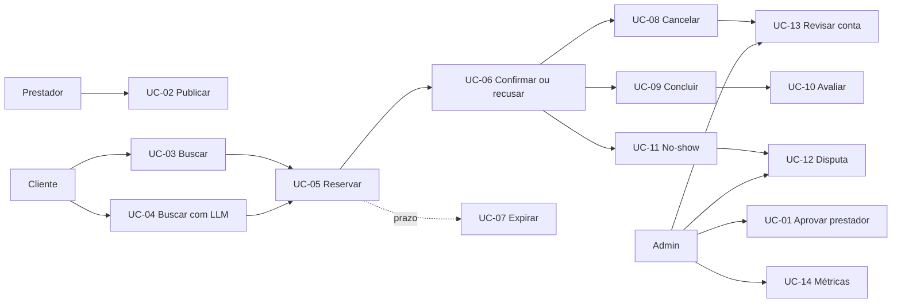

# Casos de uso

> Visão operacional dos UC-01 a UC-14. Cada caso de uso tem fluxo, exceções e rastreabilidade detalhados em [`spec.md`](spec.md), seção 10.

## Panorama

## UC-01 — Cadastrar e aprovar prestador

**Atores:** prestador e admin. O prestador cria uma conta, que nasce `PENDENTE_APROVACAO`. O admin aprova ou reprova com justificativa. Após aprovação, o prestador completa perfil, serviço e régua para publicar. Abrange RF-001 a RF-011, RN-08 e RN-28.

## UC-02 — Publicar horário vago

**Ator:** prestador. Seleciona serviço, informa início, valida antecedência e sobreposição, define régua e publica o horário com snapshot do preço-base. Régua inválida, antecedência insuficiente e conta em revisão bloqueiam a operação. Abrange RF-012 a RF-023 e RN-01 a RN-08.

## UC-03 — Buscar por filtros

**Ator:** cliente, sem autenticação para consultar. O sistema filtra horários publicados, futuros e de prestadores ativos, calcula preço vigente e piso, ordena com desempate determinístico e exibe desconto, reputação e próximo degrau. Abrange RF-024 a RF-031.

## UC-04 — Buscar por linguagem natural

**Atores:** cliente e provedor de LLM. O sistema transforma a descrição em filtros estruturados, valida a saída, registra a interpretação e executa a mesma busca determinística do UC-03. Baixa confiança, categoria inválida ou falha do LLM levam à confirmação ou ao formulário de filtros. Abrange RF-032 a RF-038 e RN-29 a RN-32.

## UC-05 — Reservar horário

**Ator:** cliente autenticado. Valida conta, reputação, limite, antecedência e disponibilidade; recalcula e trava o preço; cria agendamento `PENDENTE_CONFIRMACAO`, bloqueia o horário e notifica o prestador. Concorrência aceita exatamente uma reserva. Abrange RF-039 a RF-041 e RF-047.

## UC-06 — Confirmar ou recusar reserva

**Ator:** prestador. Visualiza o pedido e confirma, levando agendamento a `CONFIRMADO` e horário a `OCUPADO`, ou recusa com motivo. Na confirmação, os contatos ficam disponíveis às partes. Abrange RF-042 a RF-044 e RN-10 a RN-11.

## UC-07 — Expirar reserva

**Ator:** sistema. Ao vencer P-01 sem resposta, aplica a política do prestador: `LIBERAR` expira e devolve o horário quando possível; `AUTOCONFIRMAR` confirma. Notifica as partes sem penalizar o cliente. Abrange RF-044 a RF-046.

## UC-08 — Cancelar com penalidade

**Atores:** cliente ou prestador. O sistema calcula a antecedência, mostra a faixa e o delta de reputação antes da confirmação, registra o cancelamento, trata o horário, cria evento de reputação e notifica a outra parte. Após o início, o fluxo correto é no-show. Abrange RF-048 a RF-051 e RN-18 a RN-19.

## UC-09 — Concluir atendimento e apurar comissão

**Atores:** prestador ou sistema. Após o fim do horário, registra cobrança, conclui o agendamento, calcula comissão sobre o valor travado, cria lançamento e libera avaliações. A conclusão automática ocorre após P-17 quando não há no-show ou disputa. Abrange RF-058 a RF-064.

## UC-10 — Avaliação bilateral

**Atores:** cliente e prestador. Cada parte avalia a outra uma vez, com nota e comentário opcional, dentro de P-14. A avaliação permanece oculta até ambas avaliarem ou a janela terminar; a reputação é recalculada por eventos. Abrange RF-065 a RF-070.

## UC-11 — Registrar no-show

**Atores:** cliente ou prestador. Dentro da janela P-16, uma parte reporta a ausência da outra em agendamento confirmado. O sistema aplica -12, não gera comissão e abre prazo de contestação. Acusação mútua cria disputa sem penalidade automática. Abrange RF-052 a RF-055.

## UC-12 — Abrir e resolver disputa

**Atores:** cliente ou prestador na abertura; admin na resolução. A parte informa motivo e evidência; o sistema move o agendamento para `EM_DISPUTA`, retém comissão e cria SLA. O admin decide `MANTIDO`, `REVERTIDO`, `PARCIAL` ou `ARQUIVADO`, ajustando reputação, comissão e notificações. Abrange RF-071 a RF-077.

## UC-13 — Revisão administrativa de conta

**Ator:** admin. Consulta ocorrências, reputação, disputas e taxas de uma conta em `EM_REVISAO`, decide `ATIVO` ou `SUSPENSO`, registra justificativa e notifica o titular. Agendamentos já confirmados são preservados. Abrange RF-056, RF-057 e RF-078 a RF-079.

## UC-14 — Acompanhar métricas de comissão

**Ator:** admin. Consulta comissão, agendamentos concluídos, ticket médio, cancelamentos e no-shows por período, categoria ou prestador. Também pode alterar a comissão com vigência futura. Abrange RF-063, RF-064, RF-080 e RF-081.

## Regras transversais

Todo caso de uso que altera estado deve autorizar, validar domínio, garantir transição, gravar em transação, auditar e notificar. Falhas devem preservar o estado anterior; valores monetários usam centavos e o relógio é injetável nos testes.
