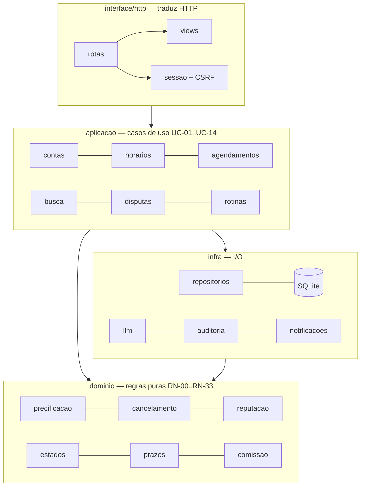
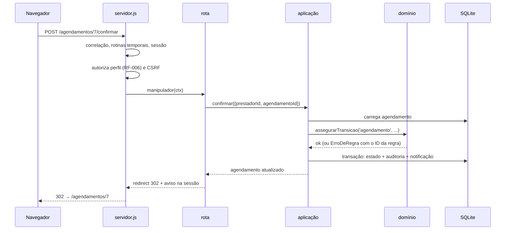

# plan.md — Plano técnico do Encaixe

> Derivado de [`spec.md`](spec.md). A spec diz **o quê** e **por quê**; este documento diz **como**.
> Nenhuma regra de negócio nasce aqui: se algo neste plano contradiz a spec, a spec vence.

| Campo | Valor |
|---|---|
| Versão | 1.0.0 |
| Data | 2026-08-21 |
| Spec de referência | v0.1.4 |
| ADRs relacionados | [001](adr/ADR-001-stack-tecnica.md) · [002](adr/ADR-002-modelo-de-dados.md) · [003](adr/ADR-003-uso-de-llm.md) · [004](adr/ADR-004-autenticacao.md) · [005](adr/ADR-005-escopo-financeiro.md) · [006](adr/ADR-006-fonte-da-marca.md) |

---

## 1. Stack

| Camada | Escolha | ADR |
|---|---|---|
| Runtime | Node.js 24 (ESM), **zero dependências de runtime** | ADR-001 |
| Persistência | `node:sqlite` (`DatabaseSync`), SQL escrito à mão | ADR-001, ADR-002 |
| HTTP | `node:http` + roteador próprio | ADR-001 |
| Interface | HTML renderizado no servidor via *template literals* com escape automático | ADR-001 |
| Tipografia | Bricolage Grotesque servida de `public/`, sem rede externa | ADR-006 |
| Autenticação | Sessão opaca em cookie + `scrypt` | ADR-004 |
| Testes | `node:test` + `node:assert/strict` | ADR-001 |
| LLM | Interface própria; provedor `simulado` (padrão) ou `anthropic` (`claude-opus-5`) | ADR-003 |

---

## 2. Arquitetura em camadas

O sistema é um **monólito em camadas com dependências apontando para dentro**. O domínio não conhece
ninguém; a infraestrutura conhece o domínio; a aplicação orquestra; a interface só traduz HTTP.



### Regra de dependência

| Camada | Pode importar | Nunca importa |
|---|---|---|
| `src/dominio/` | apenas outros módulos de domínio | banco, HTTP, LLM |
| `src/infra/` | domínio | aplicação, interface |
| `src/aplicacao/` | domínio, infra | interface |
| `src/interface/` | aplicação, domínio (só para formatar) | repositórios de escrita direta |

**Teste de fogo do domínio:** todo módulo em `src/dominio/` roda sem banco, sem rede e sem relógio real.
É por isso que `calcularPreco()` recebe `antecedenciaMin` já calculada em vez de uma data — a regra não
precisa saber que horas são, só quanto falta.

---

## 3. Estrutura de pastas

```
projeto_modelagem/
├── docs/                       # spec, plano, tarefas, ADRs, segurança, testes, review
│   ├── spec.md                 # fonte de verdade
│   ├── plan.md                 # este arquivo
│   ├── tasks.md                # tarefas atômicas → issues
│   ├── adr/                    # ADR-001 a ADR-006
│   ├── specs/                  # mapa de Specs, Specs individuais e registro do processo SDD
│   ├── identidade-visual/      # guia de marca e SVGs da logo
│   └── review/                 # revisão multidimensional
├── src/
│   ├── dominio/                # regras puras — espelha spec §6
│   │   ├── parametros.js       # P-01..P-20 (RN-00)
│   │   ├── precificacao.js     # RN-01, RN-02, RN-03
│   │   ├── reserva.js          # RN-06, RN-07, RN-09, RN-12, RN-13
│   │   ├── cancelamento.js     # RN-18, RN-19
│   │   ├── prazos.js           # RN-16, RN-20, RN-24, RN-26
│   │   ├── reputacao.js        # RN-22, RN-23
│   │   ├── comissao.js         # RN-14, RN-15, RN-16
│   │   ├── estados.js          # máquinas de estado (spec §9.4–9.7)
│   │   ├── dinheiro.js         # centavos
│   │   ├── tempo.js            # UTC/São Paulo + relógio injetável
│   │   └── erros.js            # ErroDeRegra carrega o ID da regra violada
│   ├── aplicacao/              # casos de uso — espelha spec §10
│   │   ├── contas.js           # UC-01, UC-13
│   │   ├── catalogo.js         # serviços e réguas
│   │   ├── horarios.js         # UC-02
│   │   ├── busca.js            # UC-03, UC-04
│   │   ├── agendamentos.js     # UC-05 a UC-09, UC-11
│   │   ├── avaliacoes.js       # UC-10
│   │   ├── disputas.js         # UC-12
│   │   ├── admin.js            # UC-13, UC-14
│   │   ├── reputacao.js        # serviço compartilhado (RN-21, RN-22, RN-23)
│   │   ├── precos.js           # ponte repositório ↔ precificação
│   │   └── rotinas.js          # rotinas temporais
│   ├── infra/
│   │   ├── db/                 # conexão, transações, schema.sql
│   │   ├── repositorios/       # SQL por agregado
│   │   ├── llm/                # contrato + simulado + anthropic
│   │   ├── senha.js  auditoria.js  notificacoes.js
│   ├── interface/http/
│   │   ├── servidor.js  roteador.js  sessao.js  html.js  estilo.js
│   │   ├── rotas/              # publicas, agendamentos, prestador, admin
│   │   └── views/layout.js     # layout e componentes
│   └── main.js
├── tests/
│   ├── unidade/                # domínio puro + roteador
│   ├── integracao/             # fluxos completos com banco em memória
│   └── apoio/cenario.js        # banco limpo + relógio controlado
├── scripts/                    # migrar, seed, reset
└── .specify/                   # constituição do projeto (fluxo SDD)
```

---

## 4. Ciclo de uma requisição



**Erro de regra vira mensagem com o identificador visível.** `ErroDeRegra` carrega `regra: 'RN-12'`,
e a interface exibe o selo da regra ao lado do aviso. O usuário não recebe "operação inválida": recebe
*por que* o sistema o barrou.

---

## 5. Decisões de implementação

### 5.1 Parâmetros são dados (RN-00)

Os 20+ parâmetros vivem na tabela `parametro` e têm metadados (rótulo, faixa, ajuda) em
`src/dominio/parametros.js`. O admin edita pela interface; a alteração vale só para fatos futuros.
Nenhum número de regra aparece solto no meio do código.

### 5.2 Rotinas temporais — resposta ao QA-08

Estratégia **dupla**, deliberadamente redundante:

1. **Agendador em processo** (`setInterval`, 60 s por padrão), que roda as varreduras.
2. **Disparo sob demanda** antes de qualquer leitura sensível a tempo, com trava de 15 s.

Assim o sistema fica correto mesmo se o intervalo falhar, e os testes chamam `rotinas.executar()`
diretamente com o relógio controlado. Uma rotina que quebra em um registro não impede os demais: o erro
vira `ROTINA_FALHOU` na auditoria e a varredura continua.

Rotinas: expirar reservas (`RF-045`/`RF-046`), concluir automaticamente (`RF-060`), expirar horários
publicados vencidos, encerrar horários órfãos, revelar avaliações com janela encerrada (`RN-25`).

### 5.3 Concorrência (RNF-09)

A exclusividade da reserva não é garantida por `SELECT` seguido de `INSERT` — é garantida pelo índice
único parcial de `INV-01`. A segunda reserva simultânea recebe violação de constraint, traduzida em
`ErroDeConcorrencia` (HTTP 409). SQLite serializa escritas, o que fecha a janela de corrida.

### 5.4 Transações e aninhamento

`transacao(fn)` usa `BEGIN`/`COMMIT` no nível externo e `SAVEPOINT` nos aninhados — necessário porque
casos de uso se compõem (concluir → apurar comissão → aplicar reputação).

### 5.5 Precificação sem N+1

A busca carrega as faixas de todas as réguas em uma consulta (`faixasPorRegua`) e precifica em memória.
`precos.js` é a única ponte entre repositório e `precificacao.js`, para que busca, agenda do prestador
e reserva usem **o mesmo cálculo** — se cada tela calculasse do seu jeito, o preço exibido e o preço
travado poderiam divergir.

### 5.6 Renderização e escape

`html\`\`` escapa tudo que é interpolado. Inserir markup pronto exige `cru()` — decisão explícita e
visível em revisão. Um bug de duplo escape (a página inteira saindo como texto) foi encontrado nessa
fronteira e hoje tem teste de regressão.

### 5.7 Fronteira do LLM

`src/infra/llm/contrato.js` define esquema, instrução e **validação**. Nada do que o modelo devolve
entra no sistema sem passar por `validarSaida()`. Provedor é injetável (`definirProvedor`) — é assim
que os testes simulam falha, timeout e baixa confiança.

---

## 6. Modelo físico

20 tabelas: as 19 entidades da spec §9.2 e mais `sessao` (ADR-004). Destaques em [ADR-002](adr/ADR-002-modelo-de-dados.md):

- dinheiro em **centavos** (`INTEGER`), tempo em **ISO-8601 UTC** (`TEXT`);
- enums protegidos por `CHECK`, invariantes por `UNIQUE`/`CHECK`/índice parcial;
- `preco_base_snapshot` e `valor_travado` isolam oferta e transação de edições posteriores;
- `evento_reputacao` é livro-razão; `usuario.reputacao` é cache reconstituível;
- `log_auditoria` guarda toda transição com estado anterior, novo, ator e correlação.

---

## 7. Estratégia de testes

Detalhe em [`docs/testes.md`](testes.md). Resumo:

| Nível | Onde | O que garante |
|---|---|---|
| Unidade | `tests/unidade/` | Cada regra da spec §6 isolada, com valores de fronteira |
| Integração | `tests/integracao/` | Fluxos completos (UC-03 → UC-12) com banco em memória e relógio controlado |
| HTTP | `tests/integracao/http.test.js` | Autenticação, autorização por perfil, CSRF, escape de saída |

Princípio: **toda regra de negócio da spec tem teste com o identificador dela no nome do teste**
(`T-PRECO-01 | RN-01: ...`). Rastreabilidade spec → código → teste é verificável por `grep`.

---

## 8. Ambiente e execução

```bash
node --version      # precisa ser >= 24
npm run db:seed     # cria banco e dados de demonstração
npm start           # http://localhost:3000
npm test            # suíte completa
npm run db:reset    # recomeça do zero
```

| Variável | Padrão | Uso |
|---|---|---|
| `PORT` / `HOST` | 3000 / 127.0.0.1 | Servidor |
| `DB_PATH` | `dados/encaixe.db` | Arquivo do banco |
| `LLM_PROVIDER` | `simulado` | `simulado` ou `anthropic` |
| `LLM_MODELO` | `claude-opus-5` | Modelo do provedor real |
| `LLM_TIMEOUT_MS` | `15000` | Timeout da interpretação (RNF-05) |
| `ANTHROPIC_API_KEY` | — | Necessária só com `LLM_PROVIDER=anthropic` |
| `ROTINAS_INTERVALO_MS` | `60000` | Intervalo do agendador |

---

## 9. Rastreabilidade spec → código

| Regra | Implementação | Teste |
|---|---|---|
| RN-01, RN-02, RN-03 | `dominio/precificacao.js` | `unidade/precificacao.test.js` |
| RN-04 | `aplicacao/agendamentos.js` → `valor_travado` | `integracao/fluxo-principal.test.js` |
| RN-06, RN-07 | `dominio/reserva.js` | `unidade/reserva.test.js` |
| RN-09 | índice único parcial `ux_agendamento_ativo` | `T-RESERVA-04` |
| RN-10 | `prazoDeConfirmacao` + `resolverExpiracao` | `T-EXPIRA-02/03/04` |
| RN-12, RN-13 | `assegurarClientePodeReservar` | `T-RESERVA-05/06` |
| RN-14 a RN-17 | `dominio/comissao.js`, `apurarComissao` | `unidade/comissao.test.js`, `T-DISPUTA-01` |
| RN-18, RN-19 | `dominio/cancelamento.js` | `unidade/cancelamento.test.js`, `T-CANCEL-*` |
| RN-20, RF-055 | `registrarNoShow`, `acusacaoMutua` | `T-NOSHOW-*` |
| RN-21, RN-22, RN-23 | `aplicacao/reputacao.js` | `T-REVISAO-*`, `T-REPUT-*` |
| RN-24, RN-25 | `aplicacao/avaliacoes.js` | `T-AVAL-*` |
| RN-26, RN-27 | `aplicacao/disputas.js` | `integracao/disputas.test.js` |
| RN-29 a RN-32 | `infra/llm/`, `aplicacao/busca.js` | `integracao/busca-llm.test.js` |
| RF-006, RF-007 | `interface/http/servidor.js` | `integracao/http.test.js` |

---

## 10. Riscos técnicos

| Risco | Impacto | Mitigação |
|---|---|---|
| Infraestrutura própria (roteador, sessão) tem bugs que framework não teria | Médio | Testes dedicados; dois bugs reais já encontrados e cobertos por regressão |
| `node:sqlite` é API recente | Baixo | Uso restrito ao básico (`prepare`, `run`, `get`, `all`, `exec`) |
| Provedor de LLM indisponível | Baixo | Degradação segura (`RN-31`) testada; padrão é o provedor simulado |
| Agendador em processo morre com o servidor | Baixo | Disparo sob demanda cobre a lacuna |
| Ausência de tipagem estática | Médio | Domínio puro fortemente testado + `CHECK` no banco |
