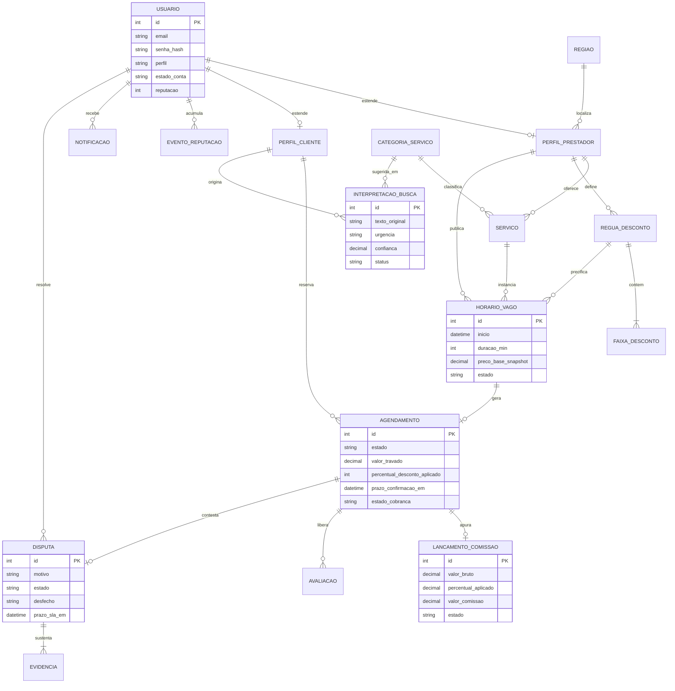
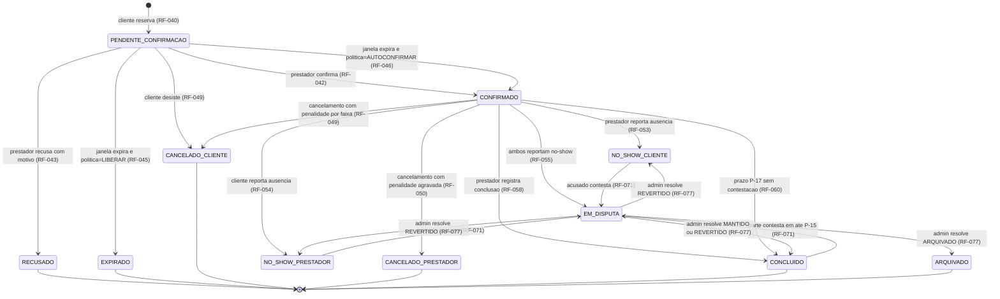
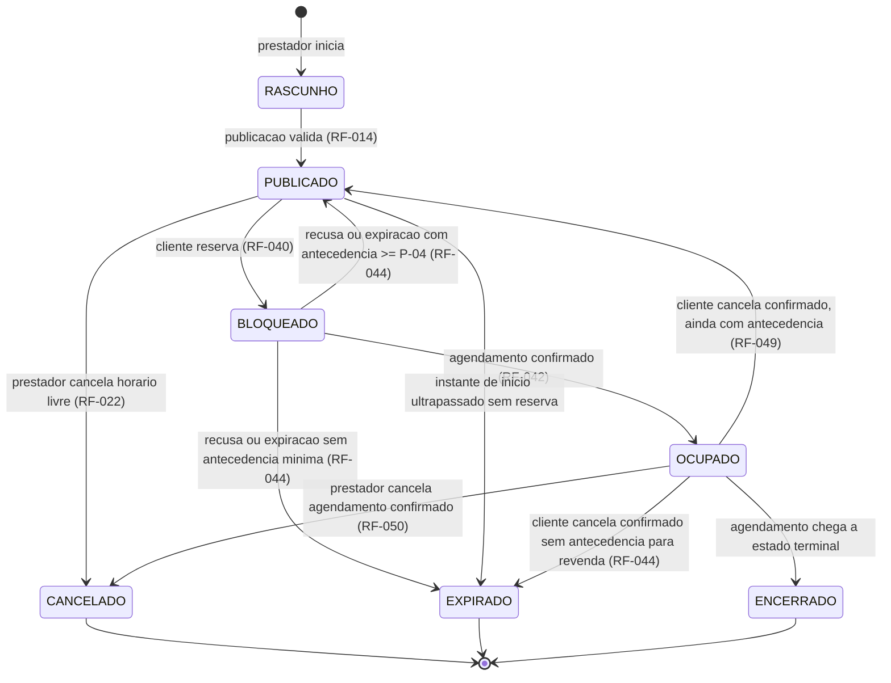
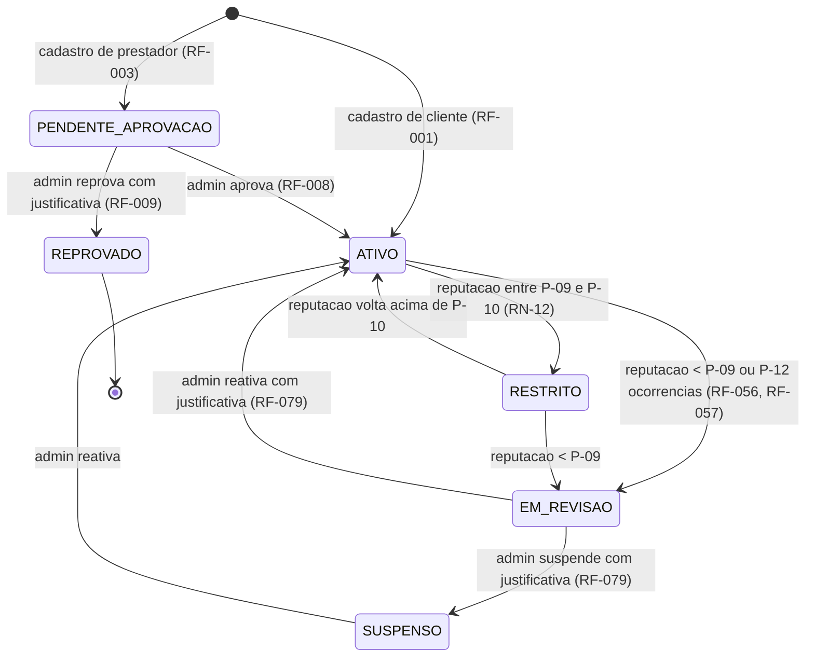
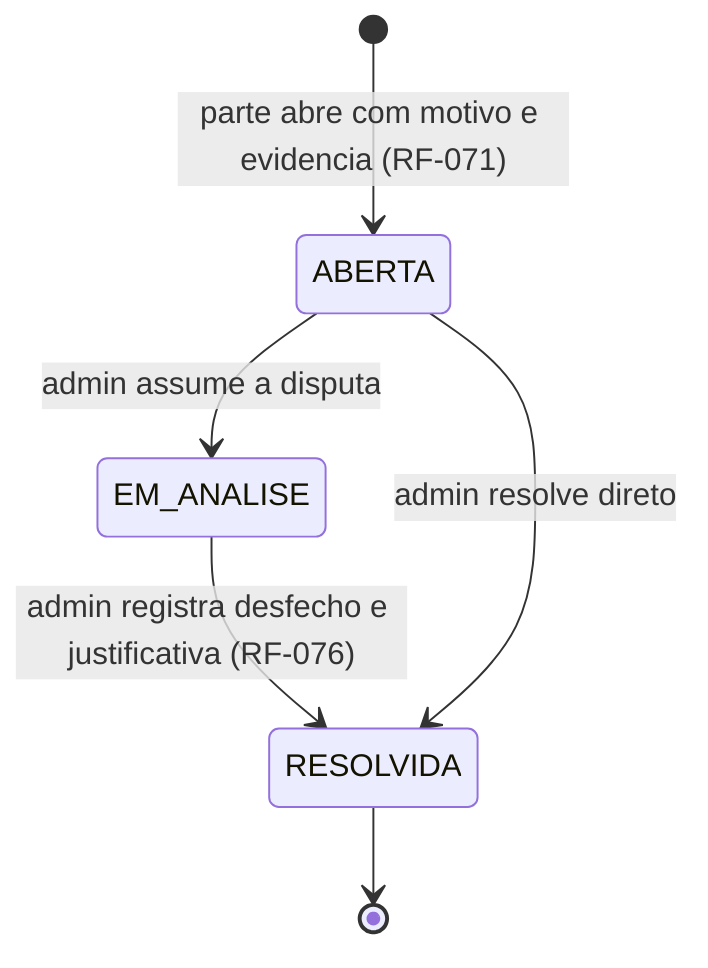
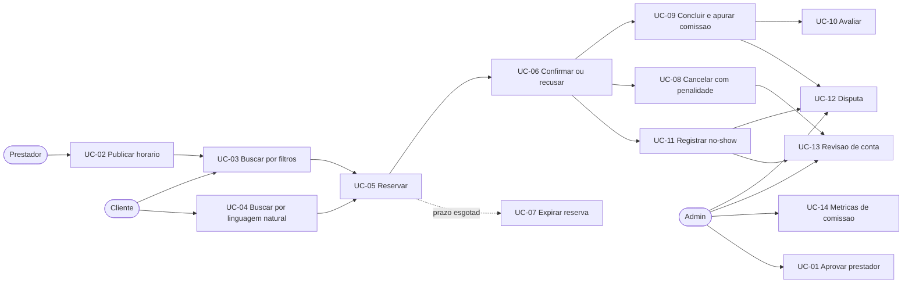

# spec.md — Encaixe

> **Marketplace de horários ociosos para prestadores de serviço locais**
> Documento de especificação — **fonte de verdade do sistema**.
> Projeto Final de Modelagem de Software · Semestre 2026-2 · Turma 04I

| Campo | Valor |
|---|---|
| Nome do produto (provisório) | **Encaixe** |
| Versão da spec | 0.1.3 |
| Data | 2026-08-21 |
| Status | Em validação com o grupo e com o professor |
| Documentos derivados | `docs/plan.md`, `docs/tasks.md`, `docs/adr/` |

### Histórico de versões

| Versão | Data | Autor | Mudança |
|---|---|---|---|
| 0.1.0 | 2026-08-21 | Equipe | Versão inicial: personas, backlog, EARS, domínio e casos de uso |
| 0.1.3 | 2026-08-21 | Equipe | Máquina de estados do horário: faltavam as transições `OCUPADO → PUBLICADO/EXPIRADO` do cancelamento pelo cliente (lacuna exposta por teste de integração) |
| 0.1.2 | 2026-08-21 | Equipe | RNF-05: timeout do LLM passa a ser configurável (padrão 15 s) |
| 0.1.1 | 2026-08-21 | Equipe | Correção da RN-01: a faixa aplicável é a de menor antecedência entre as que cobrem o instante atual (a redação anterior invertia a régua) |

> **Regra de ouro do projeto:** mudou a decisão ou o requisito, esta spec muda **antes** do código.
> Divergência entre spec e código (*spec drift*) é falha de projeto.

---

## 1. Visão geral

### 1.1 O problema em duas frases

Prestadores de serviço locais (salões, barbearias, clínicas de estética, personal trainers, oficinas) convivem
com **horários vagos de última hora** — uma desistência, um buraco na agenda — que geram **receita zero** e não
podem ser estocados: o horário das 15h de hoje deixa de existir às 15h01. Do outro lado, existe um cliente
disposto a antecipar ou improvisar um atendimento **se houver desconto proporcional à urgência**, mas hoje ele
não tem como descobrir essas vagas nem confiar em quem as oferece.

### 1.2 A solução

O **Encaixe** é um marketplace de dois lados que publica horários ociosos com **preço dinâmico** (o desconto
cresce conforme o horário se aproxima, segundo uma tabela definida pelo próprio prestador), intermedia a
reserva com **janela de confirmação**, aplica **política de cancelamento e no-show** com efeito em reputação,
e **cobra comissão percentual sobre cada agendamento efetivamente concluído**.

### 1.3 Modelo de negócio

- **Receita principal:** comissão percentual sobre o **valor final** de cada agendamento **concluído**
  (faixa operacional de 8% a 15%, ver `RN-14` e `RN-15`).
- **Receita futura (fora do MVP):** plano *premium* que dá destaque ao prestador na busca.
- A plataforma **não** cobra taxa de serviço do cliente no MVP.

### 1.4 Proposta de valor por lado

| Lado | Dor atual | O que o Encaixe entrega |
|---|---|---|
| Prestador | Buraco na agenda = receita zero; não sabe precificar urgência | Publica a vaga em segundos, define a régua de desconto e recebe cliente novo sem esforço de divulgação |
| Cliente | Não acha atendimento "para hoje"; não confia em quem tem vaga sobrando | Vê o preço já com desconto, reserva com prazo claro e usa reputação como sinal de confiança |
| Plataforma | — | Comissão só quando o encaixe acontece de fato: incentivo alinhado com os dois lados |

### 1.5 Por que o tema atende às restrições obrigatórias

| Restrição (seção 6 do enunciado) | Onde é atendida |
|---|---|
| 6.1 Múltiplos perfis | 3 perfis: Prestador, Cliente, Admin (seção 4) |
| 6.2 Persistência de estado | Máquinas de estado de Agendamento, Horário, Conta e Disputa persistidas em banco relacional (seção 9) |
| 6.3 Fluxo não trivial | Publicar → precificar dinamicamente → reservar → confirmar/expirar → cancelar com penalidade → concluir → apurar comissão → avaliar → disputar (seção 10) |
| 6.4 Regras de negócio explícitas | Seção 6, com regras numeradas e parametrizadas, separadas dos detalhes técnicos |
| 6.5 Uso estruturado de IA | LLM extrai JSON de busca; a decisão de quais horários exibir é do sistema (`RN-29`, `UC-04`, ADR-003) |

---

## 2. Escopo

### 2.1 Objetivos do MVP

1. Prestador aprovado publica horários vagos com preço-base e régua de desconto própria.
2. Cliente encontra horários (por formulário **ou** por descrição em linguagem natural) já com o preço vigente.
3. Reserva com bloqueio exclusivo, janela de confirmação e liberação automática.
4. Cancelamento com penalidade progressiva e registro de no-show.
5. Conclusão do atendimento com apuração de comissão sobre o valor final.
6. Avaliação bilateral alimentando uma reputação numérica com efeitos concretos nas permissões.
7. Fila de disputas e revisão de contas para o admin, com métricas de comissão.

### 2.2 Fora do escopo do MVP (não-objetivos)

| Item | Motivo | Tratamento no MVP |
|---|---|---|
| Integração com gateway de pagamento real | Dependência externa paga; o enunciado desaconselha (seção 5.2) | Pagamento **registrado**, não processado: estados de cobrança simulados (`RN-33`) e ADR-005 |
| Aplicativo mobile nativo | Custo de escopo | Web responsiva |
| Chat livre entre cliente e prestador | Recairia em "chat simples" (tema não aceito) e abriria risco de burlar a comissão | Notificações estruturadas do sistema + campo de observação no agendamento |
| Plano premium / destaque pago | Receita secundária | Modelado no domínio (campo `plano`) mas sem funcionalidade |
| Geolocalização por GPS e mapa | Complexidade sem ganho de aprendizado | Região por cidade + bairro (lista controlada) |
| Repasse financeiro automático ao prestador | Depende de gateway | Extrato de valores a repassar, com fechamento manual pelo admin |
| Recorrência de agenda semanal automática | Escopo | Publicação avulsa ou em lote simples |

### 2.3 Premissas

- Cada horário vago atende **um cliente por vez** (sem capacidade maior que 1 no MVP).
- Todos os horários usam o fuso `America/Sao_Paulo`.
- O pagamento ocorre presencialmente entre cliente e prestador; a plataforma registra o valor e a comissão devida.
- Volume esperado no MVP: dezenas de prestadores e centenas de agendamentos — não há requisito de escala.

---

## 3. Glossário do domínio (linguagem ubíqua)

| Termo | Definição |
|---|---|
| **Encaixe** | Ato de ocupar um horário ocioso de última hora; também o nome do produto |
| **Horário vago** | Intervalo publicado por um prestador para um serviço, com data, início, duração e preço-base |
| **Preço-base** | Valor cheio do serviço, sem desconto, definido pelo prestador |
| **Régua de desconto** | Tabela ordenada de faixas (antecedência → percentual de desconto) definida pelo prestador |
| **Preço vigente** | Preço-base menos o desconto da faixa ativa no instante da consulta |
| **Preço travado** | Preço vigente no instante da reserva, congelado até o desfecho do agendamento |
| **Antecedência** | Tempo entre o instante atual e o início do horário vago |
| **Reserva** | Pedido do cliente que bloqueia o horário e cria um agendamento pendente |
| **Janela de confirmação** | Prazo que o prestador tem para responder a uma reserva |
| **Agendamento** | Compromisso entre cliente e prestador originado de uma reserva; entidade transacional central |
| **No-show** | Ausência de uma das partes em um horário confirmado |
| **Reputação** | Pontuação de 0 a 100 por conta, derivada de eventos (avaliações, cancelamentos, no-shows) |
| **Disputa** | Contestação formal sobre o desfecho de um agendamento, resolvida pelo admin |
| **Comissão** | Percentual retido pela plataforma sobre o valor final de um agendamento concluído |
| **Interpretação de busca** | JSON estruturado extraído pelo LLM a partir do texto livre do cliente |
| **Conta em revisão** | Estado em que a conta perde permissões até decisão do admin |

---

## 4. Personas

### 4.1 Persona primária — Prestador: Renata, 34, dona de salão de bairro

- **Contexto:** salão com 3 cadeiras em bairro residencial; agenda cheia nos fins de semana, irregular de terça a quinta.
- **Comportamento:** usa o celular entre atendimentos; responde mensagens em rajadas de poucos minutos.
- **Dores:** desistência de última hora vira prejuízo; dar desconto no WhatsApp queima o preço com a clientela fixa.
- **Objetivos:** ocupar buracos da agenda sem desvalorizar o preço cheio; controlar quanto de desconto está disposta a dar.
- **Critério de sucesso:** publicar um horário em menos de 1 minuto e ser avisada da reserva a tempo de responder.
- **Medos:** cliente que reserva e não aparece; perder o controle do próprio preço.
- **Permissões-chave:** publicar/cancelar horários, confirmar/recusar reservas, reportar no-show, abrir disputa, ver extrato de comissão.

### 4.2 Persona primária — Cliente: Diego, 27, analista com rotina imprevisível

- **Contexto:** decide no mesmo dia; procura "corte hoje à tarde perto do trabalho".
- **Comportamento:** compara preço e distância em 2 minutos; desiste se o fluxo tiver muitas etapas.
- **Dores:** não sabe quem tem vaga agora; desconfia de preço muito abaixo do normal.
- **Objetivos:** resolver hoje, pagando menos por escolher um horário que ninguém quis.
- **Critério de sucesso:** achar e reservar um horário compatível em menos de 3 minutos.
- **Medos:** chegar e o prestador não estar; ser cobrado por cancelar.
- **Permissões-chave:** buscar, reservar, cancelar, avaliar, abrir disputa.

### 4.3 Persona secundária — Cliente oportunista: Bruna, 22, estudante sensível a preço

- **Contexto:** não tem urgência real; espera o desconto máximo.
- **Comportamento:** reserva vários horários "para garantir" e cancela os que não usa — **é o comportamento que as regras `RN-12`, `RN-18` e `RN-23` existem para conter**.
- **Relevância:** define o antagonista do sistema; sem ela, as políticas de penalidade não teriam justificativa.

### 4.4 Persona — Admin da plataforma: Paulo, 41, operações

- **Contexto:** cuida da saúde do marketplace; não conhece o código.
- **Objetivos:** aprovar prestadores legítimos, resolver disputas com critério consistente e acompanhar a receita de comissão.
- **Dores:** decidir disputa sem evidência; descobrir tarde que um prestador está queimando clientes.
- **Critério de sucesso:** nenhuma disputa aberta há mais de 72h; contas problemáticas aparecem sozinhas na fila de revisão.
- **Permissões-chave:** aprovar/reprovar prestador, suspender/reativar conta, resolver disputa, configurar faixa de comissão, ver métricas.

### 4.5 Matriz de permissões por perfil

| Ação | Cliente | Prestador | Admin |
|---|:--:|:--:|:--:|
| Buscar horários publicados | Sim | Sim | Sim |
| Publicar / editar horário vago | Não | Sim (próprio) | Não |
| Definir régua de desconto | Não | Sim (própria) | Não |
| Reservar horário | Sim | Não | Não |
| Confirmar / recusar reserva | Não | Sim (próprio) | Não |
| Cancelar agendamento | Sim (próprio) | Sim (próprio) | Sim (qualquer, com justificativa) |
| Reportar no-show | Sim (próprio) | Sim (próprio) | Não |
| Avaliar contraparte | Sim (próprio) | Sim (próprio) | Não |
| Abrir disputa | Sim (próprio) | Sim (próprio) | Não |
| Resolver disputa | Não | Não | Sim |
| Aprovar / suspender conta | Não | Não | Sim |
| Configurar percentual de comissão | Não | Não | Sim |
| Ver métricas consolidadas da plataforma | Não | Não | Sim |
| Ver extrato próprio de comissão | Não | Sim (próprio) | Sim |
---

## 5. Backlog inicial priorizado

Prioridade em **MoSCoW**: `M` = Must (MVP não existe sem), `S` = Should (MVP fica capenga sem),
`C` = Could (entra se sobrar tempo), `W` = Won't (fora desta versão).
Cada história vira uma issue no GitHub; as tarefas atômicas correspondentes ficam em `docs/tasks.md`.

### 5.1 Épicos

| Épico | Nome | Objetivo | Prioridade |
|---|---|---|:--:|
| **E1** | Contas e acesso | Cadastro, login, perfis e permissões | M |
| **E2** | Catálogo e agenda do prestador | Serviços, horários vagos e régua de desconto | M |
| **E3** | Preço dinâmico | Cálculo do preço vigente por antecedência | M |
| **E4** | Busca e descoberta | Busca por filtros e por linguagem natural (LLM) | M / S |
| **E5** | Reserva e confirmação | Bloqueio, janela de confirmação e expiração | M |
| **E6** | Cancelamento, no-show e penalidades | Políticas progressivas com efeito em reputação | M |
| **E7** | Conclusão e comissão | Desfecho do atendimento e apuração financeira | M |
| **E8** | Reputação e avaliação bilateral | Avaliações e efeitos nas permissões | S |
| **E9** | Administração, disputas e métricas | Moderação, fila de disputas e painel | M / S |

### 5.2 Histórias de usuário

Formato: *Como \<persona\>, quero \<ação\> para \<benefício\>.*

#### E1 — Contas e acesso

| ID | História | Prio. | Critério de aceite (resumo) | Requisitos |
|---|---|:--:|---|---|
| US-01 | Como visitante, quero me cadastrar como cliente ou prestador para usar a plataforma | M | Cadastro com e-mail único e senha; perfil escolhido no cadastro; prestador nasce `PENDENTE_APROVACAO` | RF-001, RF-003 |
| US-02 | Como usuário cadastrado, quero autenticar para acessar minha área | M | Login válido gera sessão; credencial inválida não revela qual campo errou | RF-004, RF-005 |
| US-03 | Como usuário, quero que o sistema me impeça de acessar telas de outro perfil | M | Tentativa de acessar rota de outro perfil retorna 403 e é registrada em auditoria | RF-006, RF-007 |
| US-04 | Como admin, quero aprovar ou reprovar cadastros de prestador para manter a qualidade | M | Prestador só publica após aprovação; reprovação exige justificativa | RF-008, RF-009 |
| US-05 | Como prestador, quero completar meu perfil (dados, região, categorias) para aparecer na busca | M | Perfil incompleto não pode publicar horário | RF-010, RF-011 |

#### E2 — Catálogo e agenda

| ID | História | Prio. | Critério de aceite (resumo) | Requisitos |
|---|---|:--:|---|---|
| US-06 | Como prestador, quero cadastrar meus serviços com duração e preço-base | M | Serviço tem nome, categoria, duração e preço-base > 0 | RF-012, RF-013 |
| US-07 | Como prestador, quero publicar um horário vago para um serviço | M | Horário publicado com data/hora, duração herdada e antecedência mínima respeitada | RF-014, RF-015, RF-017 |
| US-08 | Como prestador, quero ser impedido de publicar horários sobrepostos | M | Sobreposição com horário ativo é rejeitada com mensagem clara | RF-016 |
| US-09 | Como prestador, quero definir minha régua de desconto por antecedência | M | Faixas ordenadas, sem lacuna e sem contradição; validação de monotonicidade | RF-018, RF-019, RF-020 |
| US-10 | Como prestador, quero definir um preço mínimo abaixo do qual nenhum desconto pode chegar | M | Preço vigente nunca fica abaixo do piso | RF-021 |
| US-11 | Como prestador, quero cancelar um horário ainda não reservado | S | Horário `PUBLICADO` vira `CANCELADO` sem penalidade | RF-022 |
| US-12 | Como prestador, quero publicar vários horários de uma vez para o mesmo dia | C | Lote gera N horários; falha parcial é reportada item a item | RF-023 |

#### E3 — Preço dinâmico

| ID | História | Prio. | Critério de aceite (resumo) | Requisitos |
|---|---|:--:|---|---|
| US-13 | Como cliente, quero ver o preço já com o desconto vigente | M | Preço exibido = preço-base − desconto da faixa ativa, com piso aplicado | RF-024, RF-025 |
| US-14 | Como cliente, quero saber quanto estou economizando e qual o próximo degrau de desconto | S | Exibe percentual, valor economizado e horário do próximo degrau | RF-026 |
| US-15 | Como prestador, quero simular minha régua antes de salvar | C | Simulação mostra o preço em cada faixa sem persistir nada | RF-027 |

#### E4 — Busca e descoberta

| ID | História | Prio. | Critério de aceite (resumo) | Requisitos |
|---|---|:--:|---|---|
| US-16 | Como cliente, quero buscar horários por categoria, região e janela de horário | M | Retorna apenas horários `PUBLICADO`, futuros, de prestadores `ATIVO` | RF-028, RF-029, RF-030 |
| US-17 | Como cliente, quero ordenar/filtrar por preço, antecedência e reputação | S | Ordenação determinística e documentada | RF-031 |
| US-18 | Como cliente, quero descrever em texto livre o que preciso e receber horários compatíveis | S | Texto vira JSON estruturado; filtros extraídos ficam visíveis e editáveis | RF-032, RF-033, RF-034 |
| US-19 | Como cliente, quero poder corrigir a interpretação do meu texto antes de ver os resultados | S | Baixa confiança abre confirmação obrigatória dos filtros | RF-035, RF-036 |
| US-20 | Como cliente, quero continuar buscando mesmo se a IA falhar | M | Falha do LLM cai no formulário tradicional, sem erro fatal | RF-037, RF-038 |

#### E5 — Reserva e confirmação

| ID | História | Prio. | Critério de aceite (resumo) | Requisitos |
|---|---|:--:|---|---|
| US-21 | Como cliente, quero reservar um horário e travar o preço | M | Reserva cria agendamento `PENDENTE_CONFIRMACAO` e congela o preço | RF-039, RF-040 |
| US-22 | Como cliente, quero que ninguém mais consiga reservar o horário que reservei | M | Segunda reserva concorrente do mesmo horário é rejeitada | RF-041 |
| US-23 | Como prestador, quero confirmar ou recusar uma reserva dentro de um prazo | M | Confirmação muda o estado; recusa libera o horário e exige motivo | RF-042, RF-043, RF-044 |
| US-24 | Como cliente, quero que o horário volte a ficar disponível se o prestador não responder | M | Expiração automática devolve o horário à busca sem penalizar o cliente | RF-045, RF-046 |
| US-25 | Como cliente com reputação baixa, quero entender por que não consigo abrir várias reservas | S | Bloqueio informa o limite vigente e a reputação atual | RF-047 |

#### E6 — Cancelamento, no-show e penalidades

| ID | História | Prio. | Critério de aceite (resumo) | Requisitos |
|---|---|:--:|---|---|
| US-26 | Como cliente, quero cancelar sabendo antes qual será a penalidade | M | Tela mostra a faixa aplicável e o efeito antes de confirmar | RF-048, RF-049 |
| US-27 | Como prestador, quero cancelar um agendamento confirmado assumindo a penalidade | M | Penalidade do prestador é registrada e o cliente é notificado | RF-050, RF-051 |
| US-28 | Como prestador, quero reportar que o cliente não apareceu | M | No-show só pode ser reportado após o início do horário e dentro do prazo | RF-052, RF-053 |
| US-29 | Como cliente, quero reportar que o prestador não apareceu | M | Mesmo fluxo, penalizando o outro lado | RF-054 |
| US-30 | Como admin, quero que contas problemáticas entrem em revisão automaticamente | M | Gatilhos de reputação e de reincidência colocam a conta em `EM_REVISAO` | RF-055, RF-056, RF-057 |

#### E7 — Conclusão e comissão

| ID | História | Prio. | Critério de aceite (resumo) | Requisitos |
|---|---|:--:|---|---|
| US-31 | Como prestador, quero registrar que o atendimento foi realizado | M | Conclusão só a partir do fim do horário; gera lançamento de comissão | RF-058, RF-059 |
| US-32 | Como sistema, quero concluir automaticamente agendamentos sem contestação | S | Após o prazo sem no-show nem disputa, conclui e apura | RF-060 |
| US-33 | Como prestador, quero ver meu extrato com valor recebido e comissão devida | M | Extrato por período com total bruto, comissão e líquido | RF-061, RF-062 |
| US-34 | Como admin, quero acompanhar a comissão acumulada da plataforma | S | Painel com total por período, por categoria e por prestador | RF-063, RF-064 |

#### E8 — Reputação e avaliação bilateral

| ID | História | Prio. | Critério de aceite (resumo) | Requisitos |
|---|---|:--:|---|---|
| US-35 | Como cliente, quero avaliar o prestador após o atendimento | S | Avaliação liberada só em agendamento `CONCLUIDO` e dentro da janela | RF-065, RF-066 |
| US-36 | Como prestador, quero avaliar o cliente | S | Mesma janela e mesmas regras | RF-067 |
| US-37 | Como usuário, quero que a nota do outro só apareça quando ambos avaliarem | C | Revelação cega evita retaliação | RF-068 |
| US-38 | Como usuário, quero ver a reputação e o histórico resumido da contraparte | S | Reputação, número de atendimentos e taxa de no-show visíveis | RF-069, RF-070 |

#### E9 — Administração, disputas e métricas

| ID | História | Prio. | Critério de aceite (resumo) | Requisitos |
|---|---|:--:|---|---|
| US-39 | Como usuário, quero abrir disputa quando discordo do desfecho | M | Disputa exige motivo e ao menos uma evidência, dentro do prazo | RF-071, RF-072, RF-073 |
| US-40 | Como admin, quero uma fila de disputas priorizada por prazo e valor | M | Fila ordenada e com SLA visível | RF-074, RF-075 |
| US-41 | Como admin, quero resolver a disputa com um desfecho que reverte ou mantém efeitos | M | Resolução ajusta reputação, comissão e estado do agendamento | RF-076, RF-077 |
| US-42 | Como admin, quero revisar contas sinalizadas e decidir reativar ou suspender | M | Decisão registrada com justificativa e auditoria | RF-078, RF-079 |
| US-43 | Como admin, quero configurar o percentual de comissão dentro de uma faixa | S | Alteração vale para agendamentos futuros, nunca retroage | RF-080, RF-081 |
| US-44 | Como usuário, quero ser notificado das mudanças de estado que me afetam | S | Notificação por evento, visível na área do usuário | RF-082, RF-083 |
| US-45 | Como admin, quero uma trilha de auditoria das ações sensíveis | S | Toda transição de estado e ação administrativa fica registrada | RF-084, RF-085 |

### 5.3 Ordem de construção sugerida (marcos)

| Marco | Semanas | Conteúdo | Épicos |
|---|---|---|---|
| **M0 — Fundação** | 01–03 | Spec validada, stack decidida (ADR-001/002), esqueleto do projeto, CI e primeiros testes | E1 (parcial) |
| **M1 — Núcleo transacional** | 04–07 | Contas, catálogo, horários, preço dinâmico, busca por filtros, reserva e confirmação | E1, E2, E3, E4 (filtros), E5 |
| **M2 — Regras de consequência** | 08–11 | Cancelamento, no-show, reputação, conclusão e comissão | E6, E7, E8 |
| **M3 — Administração e IA** | 11–13 | Disputas, painel do admin, busca por linguagem natural (LLM) | E9, E4 (LLM) |
| **M4 — Fechamento** | 14–15 | Revisão multidimensional (`docs/review`), evidências de teste, ajuste final de spec e demo | — |

> A busca por LLM (US-18 a US-20) é deliberadamente posicionada **depois** do núcleo determinístico:
> se o cronograma apertar, o sistema continua completo sem ela, porque a decisão sempre foi do sistema (`RN-29`).
---

## 6. Regras de negócio

> Esta seção contém **apenas regras de domínio** — o *quê* e o *porquê*. Nenhuma decisão de tecnologia,
> framework, esquema de tabela ou biblioteca aparece aqui; isso vive em `docs/plan.md` e nos ADRs.
> Todo valor numérico é **parâmetro**, não constante espalhada pelo código (ver 6.1).

### 6.1 Parâmetros do domínio

Escopo: `G` = global (configurado pelo admin), `P` = por prestador, `S` = por serviço.

| ID | Parâmetro | Escopo | Valor padrão | Faixa permitida |
|---|---|:--:|---|---|
| P-01 | Janela de confirmação do prestador | P | 15 min | 5 a 60 min |
| P-02 | Política ao expirar a janela | P | `LIBERAR` | `LIBERAR` ou `AUTOCONFIRMAR` |
| P-03 | Antecedência mínima para publicar um horário | G | 60 min | 30 a 240 min |
| P-04 | Antecedência mínima para reservar | G | 30 min | 15 a 120 min |
| P-05 | Teto de desconto da plataforma | G | 60% | 30% a 80% |
| P-06 | Janela de cancelamento sem penalidade (X) | G | 6 h | 2 a 24 h |
| P-07 | Janela de penalidade total (Y) | G | 2 h | 0,5 a 6 h |
| P-08 | Reputação inicial de uma conta nova | G | 70 | 50 a 80 |
| P-09 | Limiar de revisão administrativa | G | 40 | 20 a 60 |
| P-10 | Limiar de restrição do cliente | G | 50 | 30 a 70 |
| P-11 | Limite de reservas simultâneas (normal / restrito) | G | 3 / 1 | 1 a 5 / 1 a 2 |
| P-12 | Ocorrências negativas consecutivas do prestador | G | 3 em 30 dias | 2 a 5 |
| P-13 | Percentual de comissão | G / S | 12% | 8% a 15% |
| P-14 | Janela de avaliação após a conclusão | G | 7 dias | 3 a 15 dias |
| P-15 | Prazo para abrir disputa | G | 48 h após o fim do horário | 24 a 96 h |
| P-16 | Janela para reportar no-show | G | de +15 min do início até 24 h após o fim | — |
| P-17 | Prazo de conclusão automática | G | 24 h após o fim do horário | 12 a 72 h |
| P-18 | SLA de resolução de disputa | G | 72 h | 24 a 120 h |
| P-19 | Confiança mínima da interpretação por LLM | G | 0,60 | 0,40 a 0,90 |
| P-20 | Janela móvel de apuração da reputação | G | 90 dias | 30 a 180 dias |

**RN-00 — Parâmetros são dados, não código.** O sistema DEVE ler todo parâmetro da tabela acima da base de
configuração, e a alteração de um parâmetro DEVE valer somente para fatos ocorridos após a alteração.
*Justificativa:* o enunciado exige regras explícitas e configuráveis; retroagir parâmetro reescreveria história financeira.

### 6.2 Precificação dinâmica

**RN-01 — Preço vigente por faixa de antecedência.** Cada faixa da régua declara "a partir de X minutos antes
do horário, desconto de Y%". A faixa aplicável é a de **menor antecedência entre as faixas cuja antecedência é
maior ou igual** à antecedência atual; o preço vigente é o preço-base menos o percentual dessa faixa. Se
nenhuma faixa cobrir a antecedência atual, o desconto é 0%.
*Exemplo:* régua `[(240 min, 20%), (60 min, 35%)]` — a 5 h do horário: 0%; a 3 h: 20%; a 40 min: 35%.
*Rastreio:* RF-024, UC-02, UC-03.

**RN-02 — Régua válida.** Uma régua de desconto é válida quando: tem ao menos uma faixa; as faixas têm
antecedências distintas; e o desconto é **não crescente** conforme a antecedência aumenta (quanto mais perto
do horário, maior ou igual o desconto). Régua inválida não pode ser salva.
*Justificativa:* impede uma régua em que esperar mais fica mais barato, o que induziria o cliente a não reservar.
*Rastreio:* RF-019, RF-020.

**RN-03 — Piso de preço.** O preço vigente nunca é inferior ao preço mínimo declarado pelo prestador para o
serviço, nem inferior ao preço-base menos o teto global de desconto (P-05). Vence o mais restritivo dos dois.
*Rastreio:* RF-021, RF-025.

**RN-04 — Preço travado na reserva.** O valor de um agendamento é o preço vigente no **instante da reserva**,
e não muda depois — nem se o desconto aumentar, nem se o prestador editar a régua ou o preço-base.
*Justificativa:* o cliente decide com base em um número; mudá-lo depois quebra a confiança e a base da comissão.
*Rastreio:* RF-040, RN-14.

**RN-05 — Edição de horário reservado.** Um horário com agendamento em estado `PENDENTE_CONFIRMACAO` ou
`CONFIRMADO` não pode ter preço-base, régua, data, hora ou duração alterados.
*Rastreio:* RF-017.

### 6.3 Publicação e agenda

**RN-06 — Não sobreposição.** Um prestador não pode ter dois horários ativos (`PUBLICADO`, `BLOQUEADO` ou
`OCUPADO`) cujos intervalos `[início, início + duração)` se sobreponham.
*Rastreio:* RF-016.

**RN-07 — Antecedência mínima.** Um horário só pode ser publicado com pelo menos P-03 de antecedência, e só
pode ser reservado com pelo menos P-04 de antecedência. Passado o início, o horário deixa de ser reservável.
*Justificativa:* evita vender um horário impossível de cumprir; P-04 < P-03 preserva o encaixe de última hora.
*Rastreio:* RF-015, RF-039.

**RN-08 — Elegibilidade para publicar.** Só publica horários o prestador com conta `ATIVO`, cadastro aprovado
pelo admin e perfil completo (nome, região, ao menos um serviço e uma régua válida).
*Rastreio:* RF-011, RF-014.

### 6.4 Reserva e confirmação

**RN-09 — Exclusividade da reserva.** Uma reserva bloqueia o horário para qualquer outro cliente enquanto o
agendamento estiver `PENDENTE_CONFIRMACAO` ou `CONFIRMADO`. Um horário nunca tem dois agendamentos ativos.
*Rastreio:* RF-041.

**RN-10 — Janela de confirmação e seu desfecho.** O prestador tem P-01 para responder a uma reserva, limitado
ao início do horário. Esgotado o prazo sem resposta, o desfecho segue a política P-02 do prestador:
`LIBERAR` devolve o horário para a busca e encerra o agendamento como `EXPIRADO`;
`AUTOCONFIRMAR` promove o agendamento a `CONFIRMADO`. Em qualquer caso, o cliente é notificado e **não** é penalizado.
*Nota de decisão:* o enunciado admite as duas leituras; o MVP entrega as duas como política do prestador,
com `LIBERAR` como padrão por ser a mais conservadora para quem não respondeu. Ver QA-01 na seção 13.
*Rastreio:* RF-045, RF-046, UC-07.

**RN-11 — Recusa pelo prestador.** A recusa exige motivo, encerra o agendamento como `RECUSADO`, devolve o
horário para `PUBLICADO` se ainda houver antecedência mínima (P-04) e não penaliza o cliente. Recusa **não**
conta como cancelamento para efeito de RN-19, mas é contabilizada na taxa de recusa exibida ao admin.
*Rastreio:* RF-043, RF-044.

**RN-12 — Limite de reservas simultâneas.** Um cliente com reputação abaixo de P-10 pode manter no máximo
1 agendamento em aberto (`PENDENTE_CONFIRMACAO` ou `CONFIRMADO`); acima do limiar, no máximo 3 (P-11).
*Justificativa:* contém o comportamento de "reservar tudo e escolher depois" (persona 4.3).
*Rastreio:* RF-047, UC-05.

**RN-13 — Cliente elegível a reservar.** Cliente com conta `SUSPENSO` ou `EM_REVISAO` não reserva. Cliente
`RESTRITO` reserva dentro do limite de RN-12.
*Rastreio:* RF-039.

### 6.5 Comissão

**RN-14 — Base de cálculo.** A comissão é calculada sobre o **valor final travado** do agendamento (`RN-04`),
nunca sobre o preço-base. Fórmula: `comissao = valor_final × percentual_vigente`, arredondada para 2 casas
decimais pelo critério "meio para cima".
*Rastreio:* RF-059, UC-09.

**RN-15 — Percentual vigente.** O percentual aplicável é o configurado para a categoria do serviço no momento
da **conclusão** do agendamento, respeitando a faixa de 8% a 15% (P-13). Alteração de percentual não retroage
a agendamentos já concluídos.
*Rastreio:* RF-080, RF-081.

**RN-16 — Fato gerador.** A comissão só existe para agendamento no estado `CONCLUIDO`. Agendamentos
`CANCELADO`, `RECUSADO`, `EXPIRADO` ou encerrados como no-show não geram comissão.
*Justificativa:* alinha o incentivo da plataforma ao encaixe realmente acontecer.
*Rastreio:* RF-058, RF-059.

**RN-17 — Comissão sob disputa.** Ao abrir uma disputa sobre um agendamento, o lançamento de comissão passa a
`RETIDO` e não entra no extrato até a resolução. A resolução mantém, estorna ou ajusta o lançamento.
*Rastreio:* RF-073, RF-077.

### 6.6 Cancelamento, no-show e penalidades

**RN-18 — Política de cancelamento pelo cliente.** A penalidade depende da antecedência no instante do cancelamento:

| Faixa | Condição | Efeito |
|---|---|---|
| Livre | antecedência ≥ P-06 (6 h) | Sem penalidade; agendamento `CANCELADO_CLIENTE` |
| Parcial | P-07 ≤ antecedência < P-06 (2 h a 6 h) | −3 de reputação; conta como ocorrência negativa |
| Total | antecedência < P-07 (menos de 2 h) | −6 de reputação; conta como ocorrência negativa; prestador pode converter em no-show se já estava a caminho |

Cancelar depois do início do horário não é cancelamento: é no-show (`RN-20`).
*Rastreio:* RF-048, RF-049, UC-08.

**RN-19 — Política de cancelamento pelo prestador.** O prestador pode cancelar até o início do horário; a
penalidade é sempre pelo menos igual à do cliente na mesma faixa, porque quem publicou assumiu compromisso:
faixa livre −1, faixa parcial −5, faixa total −10 de reputação, e a ocorrência entra na contagem de P-12.
*Justificativa:* assimetria proposital — cancelamento do prestador destrói mais valor para a plataforma.
*Rastreio:* RF-050, RF-051.

**RN-20 — Registro de no-show.** A partir de 15 minutos após o início e até 24 h após o fim do horário (P-16),
qualquer das partes pode reportar a ausência da outra em um agendamento `CONFIRMADO`. O reporte:
(a) leva o agendamento a `NO_SHOW_CLIENTE` ou `NO_SHOW_PRESTADOR`;
(b) aplica −12 de reputação à parte ausente;
(c) não gera comissão;
(d) abre para a parte acusada o direito de contestar em disputa dentro de P-15.
Se **ambas** as partes se acusam, o agendamento vai direto para `EM_DISPUTA` sem penalidade automática.
*Rastreio:* RF-052, RF-053, RF-054, UC-11.

**RN-21 — Ocorrências consecutivas do prestador.** Prestador que acumular P-12 ocorrências negativas
(cancelamento em faixa parcial ou total, ou no-show confirmado) dentro de 30 dias tem a conta movida para
`EM_REVISAO` e **perde o direito de publicar novos horários** até decisão do admin. Horários já confirmados
seguem válidos.
*Rastreio:* RF-055, RF-056, UC-13.

**RN-22 — Revisão por reputação.** Conta de qualquer perfil com reputação abaixo de P-09 entra em `EM_REVISAO`
automaticamente. Cliente entre P-09 e P-10 fica `RESTRITO` (RN-12).
*Rastreio:* RF-057, UC-13.

### 6.7 Reputação e avaliação

**RN-23 — Cálculo da reputação.** A reputação é um número inteiro de 0 a 100, inicia em P-08 e é recalculada a
cada evento, considerando apenas eventos dos últimos P-20 dias:

| Evento | Delta |
|---|---|
| Agendamento concluído sem incidente | +1 |
| Avaliação recebida 5 estrelas | +3 |
| Avaliação recebida 4 estrelas | +1 |
| Avaliação recebida 3 estrelas | 0 |
| Avaliação recebida 2 estrelas | −2 |
| Avaliação recebida 1 estrela | −4 |
| Cancelamento em faixa parcial | −3 (cliente) / −5 (prestador) |
| Cancelamento em faixa total | −6 (cliente) / −10 (prestador) |
| No-show confirmado | −12 |
| Disputa resolvida contra a parte | −8 adicionais |
| Disputa resolvida a favor da parte | reverte integralmente a penalidade que havia sido aplicada |

O resultado é sempre truncado ao intervalo [0, 100]. Todo delta é registrado como um **evento de reputação**
com origem rastreável — a reputação nunca é editada diretamente.
*Rastreio:* RF-069, RF-070.

**RN-24 — Elegibilidade e janela de avaliação.** Só agendamento `CONCLUIDO` libera avaliação, por ambas as
partes, durante P-14 dias. Cada parte avalia a outra **uma única vez**, com nota de 1 a 5 e comentário opcional.
*Rastreio:* RF-065, RF-066, RF-067.

**RN-25 — Revelação cega.** As avaliações de um agendamento só ficam visíveis quando ambas as partes avaliarem
ou quando a janela P-14 encerrar, o que ocorrer primeiro.
*Justificativa:* evita avaliação por retaliação.
*Rastreio:* RF-068.

### 6.8 Disputas e moderação

**RN-26 — Abertura de disputa.** Qualquer das partes pode abrir disputa sobre um agendamento nos estados
`CONCLUIDO`, `NO_SHOW_CLIENTE` ou `NO_SHOW_PRESTADOR`, em até P-15 após o fim do horário, informando motivo
(categoria fechada) e ao menos uma evidência (texto descritivo e/ou arquivo). Abrir disputa move o agendamento
para `EM_DISPUTA`, congela a comissão (`RN-17`) e suspende os efeitos de reputação ainda reversíveis.
*Rastreio:* RF-071, RF-072, RF-073, UC-12.

**RN-27 — Resolução de disputa.** Só o admin resolve, escolhendo um desfecho entre:
`MANTIDO` (confirma o desfecho original), `REVERTIDO` (aplica o desfecho oposto),
`PARCIAL` (mantém o desfecho mas remove a penalidade de reputação) ou `ARQUIVADO` (sem elementos para decidir,
sem penalidade para nenhum dos lados). A decisão exige justificativa textual, ajusta reputação e comissão
conforme RN-17 e RN-23, e é definitiva no MVP (sem instância de recurso).
*Rastreio:* RF-076, RF-077, UC-12.

**RN-28 — Aprovação e suspensão de contas.** Prestador novo nasce `PENDENTE_APROVACAO` e não aparece na busca
nem publica horários até ser aprovado. O admin pode suspender qualquer conta com justificativa; conta
`SUSPENSO` não autentica em funcionalidades de negócio e tem seus horários `PUBLICADO` retirados da busca,
preservando os agendamentos já `CONFIRMADO`.
*Rastreio:* RF-008, RF-009, RF-078, RF-079.

### 6.9 Uso do LLM na busca

**RN-29 — O modelo interpreta, o sistema decide.** A saída do LLM é exclusivamente um objeto estruturado com
`categoria_servico`, `duracao_estimada_min`, `urgencia`, `janela_inicio`, `janela_fim`, `regiao` e `confianca`.
A seleção, o filtro e a ordenação dos horários exibidos são feitos **integralmente por regras determinísticas
do sistema** sobre dados do banco. O LLM nunca escolhe prestador, nunca calcula preço, nunca decide desconto
e nunca altera estado de agendamento.
*Rastreio:* RF-032, RF-033, UC-04, ADR-003.

**RN-30 — Confiança e confirmação.** Se a confiança da interpretação for menor que P-19, ou se a categoria
extraída não existir no catálogo, o sistema DEVE apresentar os filtros interpretados para confirmação ou
correção do cliente **antes** de executar a busca.
*Rastreio:* RF-035, RF-036.

**RN-31 — Degradação segura.** Indisponibilidade, erro ou resposta fora do formato esperado do LLM não impede
a busca: o sistema cai para o formulário de filtros e registra a falha para acompanhamento.
*Justificativa:* a funcionalidade central não pode depender de um serviço externo não determinístico.
*Rastreio:* RF-037, RF-038.

**RN-32 — Rastreabilidade da interpretação.** Toda interpretação é persistida com texto original, saída
estruturada, confiança, modelo utilizado e desfecho (aceita, corrigida pelo cliente, descartada), permitindo
medir a qualidade da extração ao longo do semestre.
*Rastreio:* RF-034, RF-085.

### 6.10 Pagamento (escopo reduzido do MVP)

**RN-33 — Pagamento registrado, não processado.** O MVP não movimenta dinheiro. O agendamento carrega um
estado de cobrança (`PENDENTE`, `PAGO_PRESENCIAL`, `NAO_PAGO`) informado pelo prestador na conclusão, e a
comissão devida é apenas **lançada** no extrato. Nenhum requisito depende de gateway externo.
*Rastreio:* RF-058, RF-061, ADR-005.
---

## 7. Requisitos funcionais (notação EARS)

**Padrões EARS usados:**

| Padrão | Forma | Marcação |
|---|---|---|
| Ubíquo | O sistema DEVE `<resposta>` | *(Ubíquo)* |
| Dirigido a evento | **QUANDO** `<gatilho>`, o sistema DEVE `<resposta>` | *(Evento)* |
| Dirigido a estado | **ENQUANTO** `<estado>`, o sistema DEVE `<resposta>` | *(Estado)* |
| Comportamento indesejado | **SE** `<condição>`, **ENTÃO** o sistema DEVE `<resposta>` | *(Indesejado)* |
| Opcional | **ONDE** `<funcionalidade presente>`, o sistema DEVE `<resposta>` | *(Opcional)* |
| Complexo | Combinação dos anteriores | *(Complexo)* |

Cada requisito traz o rastreio para a regra de negócio (`RN`), o caso de uso (`UC`) e a história (`US`).

### 7.1 Contas, autenticação e autorização

- **RF-001** *(Evento)* — **QUANDO** um visitante submeter o formulário de cadastro com e-mail não utilizado, senha válida e perfil escolhido, o sistema DEVE criar a conta correspondente e registrar a data de criação. ↳ *US-01*
- **RF-002** *(Indesejado)* — **SE** o e-mail informado no cadastro já pertencer a uma conta, **ENTÃO** o sistema DEVE recusar o cadastro e informar que o e-mail não está disponível, sem revelar dados da conta existente. ↳ *US-01, RNF-03*
- **RF-003** *(Evento)* — **QUANDO** uma conta for criada com o perfil Prestador, o sistema DEVE colocá-la no estado `PENDENTE_APROVACAO` e notificar a fila de moderação do admin. ↳ *RN-28, US-01, UC-01*
- **RF-004** *(Evento)* — **QUANDO** um usuário submeter credenciais válidas de uma conta não suspensa, o sistema DEVE iniciar uma sessão autenticada vinculada ao perfil da conta. ↳ *US-02*
- **RF-005** *(Indesejado)* — **SE** as credenciais forem inválidas, **ENTÃO** o sistema DEVE recusar a autenticação com mensagem genérica, sem indicar se o erro foi no e-mail ou na senha. ↳ *US-02, RNF-03*
- **RF-006** *(Ubíquo)* — O sistema DEVE autorizar cada operação com base no perfil da sessão e na titularidade do recurso, negando toda operação fora da matriz de permissões da seção 4.5. ↳ *US-03*
- **RF-007** *(Indesejado)* — **SE** uma sessão tentar executar operação não permitida ao seu perfil, **ENTÃO** o sistema DEVE negar a operação, retornar erro de autorização e registrar a tentativa na trilha de auditoria. ↳ *US-03, RF-084*
- **RF-008** *(Evento)* — **QUANDO** o admin aprovar um prestador `PENDENTE_APROVACAO`, o sistema DEVE mover a conta para `ATIVO` e notificar o prestador. ↳ *RN-28, US-04, UC-01*
- **RF-009** *(Evento)* — **QUANDO** o admin reprovar um cadastro, o sistema DEVE exigir justificativa textual, mover a conta para `REPROVADO` e notificar o prestador com o motivo. ↳ *RN-28, US-04*
- **RF-010** *(Evento)* — **QUANDO** um prestador salvar seu perfil, o sistema DEVE persistir nome de exibição, descrição, região de atendimento e categorias atendidas. ↳ *US-05*
- **RF-011** *(Estado)* — **ENQUANTO** um prestador não tiver perfil completo, ao menos um serviço cadastrado e uma régua de desconto válida, o sistema DEVE impedir a publicação de horários e indicar o que falta. ↳ *RN-08, US-05*

### 7.2 Serviços e horários vagos

- **RF-012** *(Evento)* — **QUANDO** um prestador cadastrar um serviço, o sistema DEVE persistir nome, categoria, duração em minutos, preço-base e preço mínimo. ↳ *US-06*
- **RF-013** *(Indesejado)* — **SE** o preço-base for menor ou igual a zero, a duração não for múltiplo de 5 minutos, ou o preço mínimo for maior que o preço-base, **ENTÃO** o sistema DEVE recusar o cadastro e apontar o campo inválido. ↳ *US-06*
- **RF-014** *(Evento)* — **QUANDO** um prestador `ATIVO` publicar um horário vago informando serviço, data e hora de início, o sistema DEVE criar o horário no estado `PUBLICADO`, herdando duração e preço-base do serviço. ↳ *RN-08, US-07, UC-02*
- **RF-015** *(Indesejado)* — **SE** a antecedência do horário informado for menor que o parâmetro P-03, **ENTÃO** o sistema DEVE recusar a publicação e informar a antecedência mínima exigida. ↳ *RN-07, US-07*
- **RF-016** *(Indesejado)* — **SE** o intervalo do horário a publicar se sobrepuser a outro horário ativo do mesmo prestador, **ENTÃO** o sistema DEVE recusar a publicação e identificar o horário conflitante. ↳ *RN-06, US-08*
- **RF-017** *(Indesejado)* — **SE** um prestador tentar alterar data, hora, duração, preço-base ou régua de um horário com agendamento `PENDENTE_CONFIRMACAO` ou `CONFIRMADO`, **ENTÃO** o sistema DEVE recusar a alteração. ↳ *RN-05, US-07*
- **RF-018** *(Evento)* — **QUANDO** um prestador salvar sua régua de desconto, o sistema DEVE persistir a lista de faixas como pares (antecedência em minutos, percentual de desconto). ↳ *US-09, UC-02*
- **RF-019** *(Indesejado)* — **SE** a régua tiver faixas com antecedências repetidas, percentual fora do intervalo de 0% a P-05, ou nenhuma faixa, **ENTÃO** o sistema DEVE recusar a régua e apontar a faixa inválida. ↳ *RN-02, US-09*
- **RF-020** *(Indesejado)* — **SE** a régua tiver desconto que aumente conforme a antecedência aumenta, **ENTÃO** o sistema DEVE recusar a régua por violar a monotonicidade exigida. ↳ *RN-02, US-09*
- **RF-021** *(Ubíquo)* — O sistema DEVE garantir que nenhum preço vigente calculado fique abaixo do preço mínimo do serviço nem abaixo do preço-base descontado do teto P-05. ↳ *RN-03, US-10*
- **RF-022** *(Evento)* — **QUANDO** um prestador cancelar um horário no estado `PUBLICADO`, o sistema DEVE mover o horário para `CANCELADO` sem aplicar penalidade. ↳ *US-11*
- **RF-023** *(Opcional)* — **ONDE** a publicação em lote estiver disponível, o sistema DEVE criar um horário por entrada válida e reportar individualmente as entradas recusadas, sem abortar as demais. ↳ *US-12*

### 7.3 Preço dinâmico

- **RF-024** *(Ubíquo)* — O sistema DEVE calcular o preço vigente de um horário como o preço-base menos o desconto da faixa da régua aplicável à antecedência no instante da consulta. ↳ *RN-01, US-13, UC-03*
- **RF-025** *(Complexo)* — **QUANDO** o preço calculado for inferior ao piso definido em `RN-03`, o sistema DEVE exibir o piso como preço vigente e sinalizar que o desconto máximo foi atingido. ↳ *RN-03, US-13*
- **RF-026** *(Evento)* — **QUANDO** o sistema exibir um horário na busca ou no detalhe, o sistema DEVE apresentar preço-base, preço vigente, percentual de desconto aplicado e o instante em que o próximo degrau de desconto entra em vigor, quando houver. ↳ *RN-01, US-14*
- **RF-027** *(Opcional)* — **ONDE** o simulador de régua estiver disponível, o sistema DEVE exibir o preço resultante em cada faixa sem persistir alterações. ↳ *US-15*

### 7.4 Busca e descoberta

- **RF-028** *(Evento)* — **QUANDO** um cliente submeter uma busca por categoria, região e janela de horário, o sistema DEVE retornar os horários compatíveis com os filtros informados. ↳ *US-16, UC-03*
- **RF-029** *(Ubíquo)* — O sistema DEVE incluir nos resultados de busca apenas horários no estado `PUBLICADO` cujo início seja posterior ao instante atual acrescido de P-04. ↳ *RN-07, US-16*
- **RF-030** *(Ubíquo)* — O sistema DEVE excluir dos resultados de busca horários de prestadores em estado diferente de `ATIVO`. ↳ *RN-28, US-16*
- **RF-031** *(Evento)* — **QUANDO** o cliente escolher um critério de ordenação, o sistema DEVE ordenar os resultados por esse critério (preço vigente, proximidade do horário ou reputação do prestador), aplicando o identificador do horário como desempate determinístico. ↳ *US-17*
- **RF-032** *(Evento)* — **QUANDO** um cliente submeter uma descrição em linguagem natural, o sistema DEVE solicitar ao provedor de LLM uma interpretação estruturada contendo categoria de serviço, duração estimada, urgência, janela de horário, região e grau de confiança. ↳ *RN-29, US-18, UC-04*
- **RF-033** *(Ubíquo)* — O sistema DEVE selecionar, filtrar e ordenar os horários exibidos exclusivamente por regras determinísticas próprias, usando a interpretação do LLM apenas como conjunto de filtros de entrada. ↳ *RN-29, US-18, ADR-003*
- **RF-034** *(Evento)* — **QUANDO** uma interpretação for produzida, o sistema DEVE persistir texto original, saída estruturada, confiança, identificação do modelo e desfecho da interpretação. ↳ *RN-32, US-18*
- **RF-035** *(Indesejado)* — **SE** a confiança da interpretação for menor que P-19, **ENTÃO** o sistema DEVE exibir os filtros interpretados para confirmação ou correção do cliente antes de executar a busca. ↳ *RN-30, US-19*
- **RF-036** *(Indesejado)* — **SE** a categoria extraída não existir no catálogo de categorias, **ENTÃO** o sistema DEVE solicitar ao cliente que escolha uma categoria válida, sem executar a busca. ↳ *RN-30, US-19*
- **RF-037** *(Indesejado)* — **SE** o provedor de LLM retornar erro, resposta fora do formato esperado ou não responder dentro do tempo limite, **ENTÃO** o sistema DEVE apresentar o formulário de busca por filtros, informar que a interpretação automática não estava disponível e registrar a falha. ↳ *RN-31, US-20*
- **RF-038** *(Ubíquo)* — O sistema DEVE limitar a espera pela resposta do LLM a um tempo máximo configurado, interrompendo a chamada ao ultrapassá-lo. ↳ *RN-31, US-20, RNF-05*

### 7.5 Reserva e confirmação

- **RF-039** *(Complexo)* — **QUANDO** um cliente elegível solicitar a reserva de um horário `PUBLICADO` com antecedência maior ou igual a P-04, o sistema DEVE registrar a reserva; **SE** o cliente estiver `SUSPENSO`, `EM_REVISAO` ou acima do seu limite de reservas simultâneas, **ENTÃO** o sistema DEVE recusar a reserva informando o motivo. ↳ *RN-12, RN-13, US-21, US-25, UC-05*
- **RF-040** *(Evento)* — **QUANDO** uma reserva for registrada, o sistema DEVE criar um agendamento no estado `PENDENTE_CONFIRMACAO`, gravar o preço vigente como valor travado, mover o horário para `BLOQUEADO` e notificar o prestador. ↳ *RN-04, RN-09, US-21, UC-05*
- **RF-041** *(Indesejado)* — **SE** duas reservas concorrerem pelo mesmo horário, **ENTÃO** o sistema DEVE aceitar exatamente uma e recusar a outra informando que o horário deixou de estar disponível. ↳ *RN-09, US-22*
- **RF-042** *(Evento)* — **QUANDO** o prestador confirmar um agendamento `PENDENTE_CONFIRMACAO`, o sistema DEVE mover o agendamento para `CONFIRMADO`, o horário para `OCUPADO` e notificar o cliente. ↳ *US-23, UC-06*
- **RF-043** *(Evento)* — **QUANDO** o prestador recusar um agendamento, o sistema DEVE exigir motivo, mover o agendamento para `RECUSADO` e notificar o cliente com o motivo. ↳ *RN-11, US-23, UC-06*
- **RF-044** *(Complexo)* — **QUANDO** um agendamento for `RECUSADO` ou `EXPIRADO`, o sistema DEVE devolver o horário para `PUBLICADO` caso ainda reste a antecedência mínima P-04; caso contrário, DEVE mover o horário para `EXPIRADO`. ↳ *RN-10, RN-11, UC-07*
- **RF-045** *(Complexo)* — **ENQUANTO** um agendamento estiver `PENDENTE_CONFIRMACAO`, **QUANDO** decorrer a janela P-01 do prestador sem resposta e a política P-02 for `LIBERAR`, o sistema DEVE mover o agendamento para `EXPIRADO`, liberar o horário conforme RF-044 e notificar ambas as partes, sem penalizar o cliente. ↳ *RN-10, US-24, UC-07*
- **RF-046** *(Complexo)* — **ENQUANTO** um agendamento estiver `PENDENTE_CONFIRMACAO`, **QUANDO** decorrer a janela P-01 do prestador sem resposta e a política P-02 for `AUTOCONFIRMAR`, o sistema DEVE mover o agendamento para `CONFIRMADO`, o horário para `OCUPADO` e notificar ambas as partes. ↳ *RN-10, US-24, UC-07*
- **RF-047** *(Estado)* — **ENQUANTO** um cliente tiver reputação abaixo de P-10, o sistema DEVE limitar seus agendamentos em aberto ao limite restrito de P-11 e informar o limite vigente ao recusar uma nova reserva. ↳ *RN-12, US-25*

### 7.6 Cancelamento, no-show e penalidades

- **RF-048** *(Evento)* — **QUANDO** um usuário iniciar o cancelamento de um agendamento, o sistema DEVE exibir, antes da confirmação, a faixa de penalidade aplicável e o efeito exato sobre a reputação. ↳ *RN-18, RN-19, US-26, UC-08*
- **RF-049** *(Complexo)* — **QUANDO** o cliente confirmar o cancelamento de um agendamento `PENDENTE_CONFIRMACAO` ou `CONFIRMADO` antes do início do horário, o sistema DEVE mover o agendamento para `CANCELADO_CLIENTE`, aplicar a penalidade da faixa correspondente de `RN-18`, liberar o horário conforme RF-044 e notificar o prestador. ↳ *RN-18, US-26, UC-08*
- **RF-050** *(Complexo)* — **QUANDO** o prestador confirmar o cancelamento de um agendamento antes do início do horário, o sistema DEVE mover o agendamento para `CANCELADO_PRESTADOR`, aplicar a penalidade de `RN-19`, mover o horário para `CANCELADO` e registrar uma ocorrência negativa. ↳ *RN-19, RN-21, US-27, UC-08*
- **RF-051** *(Evento)* — **QUANDO** um agendamento for cancelado por qualquer das partes, o sistema DEVE notificar a outra parte informando motivo, faixa aplicada e efeito na reputação. ↳ *US-27, RF-082*
- **RF-052** *(Indesejado)* — **SE** um reporte de no-show for feito antes de 15 minutos do início do horário, depois do prazo P-16, ou sobre agendamento que não esteja `CONFIRMADO`, **ENTÃO** o sistema DEVE recusar o reporte informando a janela válida. ↳ *RN-20, US-28*
- **RF-053** *(Complexo)* — **QUANDO** o prestador reportar a ausência do cliente dentro da janela válida, o sistema DEVE mover o agendamento para `NO_SHOW_CLIENTE`, aplicar a penalidade de reputação de `RN-23`, não gerar comissão e abrir para o cliente o direito de contestação até P-15. ↳ *RN-20, RN-16, US-28, UC-11*
- **RF-054** *(Complexo)* — **QUANDO** o cliente reportar a ausência do prestador dentro da janela válida, o sistema DEVE mover o agendamento para `NO_SHOW_PRESTADOR`, aplicar a penalidade correspondente, registrar ocorrência negativa para o prestador e abrir o direito de contestação. ↳ *RN-20, RN-21, US-29, UC-11*
- **RF-055** *(Indesejado)* — **SE** ambas as partes reportarem no-show sobre o mesmo agendamento, **ENTÃO** o sistema DEVE mover o agendamento para `EM_DISPUTA` sem aplicar penalidade automática a nenhuma delas. ↳ *RN-20, UC-12*
- **RF-056** *(Evento)* — **QUANDO** um prestador acumular P-12 ocorrências negativas em 30 dias, o sistema DEVE mover a conta para `EM_REVISAO`, impedir a publicação de novos horários e inserir a conta na fila de revisão do admin, preservando os agendamentos já `CONFIRMADO`. ↳ *RN-21, US-30, UC-13*
- **RF-057** *(Evento)* — **QUANDO** a reputação de uma conta cair abaixo de P-09, o sistema DEVE mover a conta para `EM_REVISAO` e notificar o titular e o admin. ↳ *RN-22, US-30, UC-13*

### 7.7 Conclusão do atendimento e comissão

- **RF-058** *(Complexo)* — **QUANDO** o prestador registrar a conclusão de um agendamento `CONFIRMADO` após o fim do horário, o sistema DEVE mover o agendamento para `CONCLUIDO` e registrar o estado de cobrança informado; **SE** o registro ocorrer antes do fim do horário, **ENTÃO** o sistema DEVE recusar a operação. ↳ *RN-16, RN-33, US-31, UC-09*
- **RF-059** *(Evento)* — **QUANDO** um agendamento for movido para `CONCLUIDO`, o sistema DEVE criar um lançamento de comissão calculado sobre o valor travado, aplicando o percentual vigente da categoria, e registrar valor bruto, comissão e valor líquido do prestador. ↳ *RN-14, RN-15, US-31, UC-09*
- **RF-060** *(Complexo)* — **ENQUANTO** um agendamento permanecer `CONFIRMADO`, **QUANDO** decorrer o prazo P-17 após o fim do horário sem conclusão, sem reporte de no-show e sem disputa, o sistema DEVE concluí-lo automaticamente e apurar a comissão. ↳ *RN-16, US-32, UC-09*
- **RF-061** *(Evento)* — **QUANDO** um prestador solicitar seu extrato para um período, o sistema DEVE apresentar os agendamentos concluídos com valor bruto, comissão retida e valor líquido, além dos totais do período. ↳ *US-33*
- **RF-062** *(Ubíquo)* — O sistema DEVE excluir do extrato os lançamentos em estado `RETIDO` por disputa em aberto, sinalizando-os separadamente. ↳ *RN-17, US-33*
- **RF-063** *(Evento)* — **QUANDO** o admin acessar o painel de métricas, o sistema DEVE apresentar comissão acumulada, número de agendamentos concluídos, taxa de cancelamento e taxa de no-show no período selecionado. ↳ *US-34*
- **RF-064** *(Evento)* — **QUANDO** o admin filtrar as métricas por categoria de serviço ou por prestador, o sistema DEVE recalcular os indicadores exibidos para o recorte escolhido. ↳ *US-34*

### 7.8 Avaliação e reputação

- **RF-065** *(Estado)* — **ENQUANTO** um agendamento estiver `CONCLUIDO` e dentro da janela P-14, o sistema DEVE permitir que cada parte registre uma avaliação da outra com nota de 1 a 5 e comentário opcional. ↳ *RN-24, US-35, UC-10*
- **RF-066** *(Indesejado)* — **SE** uma parte tentar avaliar duas vezes o mesmo agendamento, avaliar fora da janela P-14 ou avaliar agendamento não concluído, **ENTÃO** o sistema DEVE recusar a avaliação informando o motivo. ↳ *RN-24, US-35*
- **RF-067** *(Evento)* — **QUANDO** o prestador registrar a avaliação do cliente, o sistema DEVE aplicar as mesmas regras de janela, unicidade e escala válidas para o cliente. ↳ *RN-24, US-36*
- **RF-068** *(Complexo)* — **ENQUANTO** apenas uma das partes tiver avaliado e a janela P-14 não tiver encerrado, o sistema DEVE manter as avaliações do agendamento ocultas para ambas; **QUANDO** ambas avaliarem ou a janela encerrar, o sistema DEVE torná-las visíveis. ↳ *RN-25, US-37*
- **RF-069** *(Evento)* — **QUANDO** ocorrer qualquer evento com efeito em reputação, o sistema DEVE registrar um evento de reputação com origem, delta e data, e recalcular a reputação da conta considerando apenas eventos dentro da janela P-20, limitando o resultado ao intervalo de 0 a 100. ↳ *RN-23, US-38*
- **RF-070** *(Ubíquo)* — O sistema DEVE exibir, no perfil público de cada conta, a reputação atual, a quantidade de atendimentos concluídos e a taxa de no-show, sem expor dados pessoais de contato. ↳ *RN-23, US-38, RNF-04*

### 7.9 Disputas, administração e rastreabilidade

- **RF-071** *(Evento)* — **QUANDO** uma parte abrir disputa sobre agendamento em estado `CONCLUIDO`, `NO_SHOW_CLIENTE` ou `NO_SHOW_PRESTADOR` dentro do prazo P-15, o sistema DEVE criar a disputa no estado `ABERTA` e mover o agendamento para `EM_DISPUTA`. ↳ *RN-26, US-39, UC-12*
- **RF-072** *(Indesejado)* — **SE** a abertura de disputa não trouxer motivo de uma lista fechada e ao menos uma evidência, **ENTÃO** o sistema DEVE recusar a abertura informando o que falta. ↳ *RN-26, US-39*
- **RF-073** *(Evento)* — **QUANDO** uma disputa for aberta, o sistema DEVE mover o lançamento de comissão associado para `RETIDO` e suspender os efeitos de reputação reversíveis do agendamento. ↳ *RN-17, RN-26, US-39*
- **RF-074** *(Evento)* — **QUANDO** o admin acessar a fila de disputas, o sistema DEVE apresentá-las ordenadas por tempo restante de SLA e, em empate, por valor do agendamento. ↳ *US-40, UC-12*
- **RF-075** *(Estado)* — **ENQUANTO** uma disputa estiver aberta há mais tempo que P-18, o sistema DEVE sinalizá-la como fora do SLA na fila do admin. ↳ *US-40*
- **RF-076** *(Evento)* — **QUANDO** o admin registrar a resolução de uma disputa, o sistema DEVE exigir um desfecho entre `MANTIDO`, `REVERTIDO`, `PARCIAL` e `ARQUIVADO` acompanhado de justificativa textual. ↳ *RN-27, US-41, UC-12*
- **RF-077** *(Complexo)* — **QUANDO** uma disputa for resolvida, o sistema DEVE aplicar o desfecho ao agendamento, ajustar os eventos de reputação das partes conforme `RN-23` e liberar, estornar ou ajustar o lançamento de comissão conforme o desfecho. ↳ *RN-17, RN-27, US-41, UC-12*
- **RF-078** *(Evento)* — **QUANDO** o admin acessar a fila de revisão de contas, o sistema DEVE listar as contas em `EM_REVISAO` com o motivo do sinalizador, a reputação atual e o histórico de ocorrências. ↳ *RN-21, RN-22, US-42, UC-13*
- **RF-079** *(Evento)* — **QUANDO** o admin decidir sobre uma conta em revisão, o sistema DEVE aplicar a decisão (`ATIVO` ou `SUSPENSO`), exigir justificativa e notificar o titular. ↳ *RN-28, US-42, UC-13*
- **RF-080** *(Evento)* — **QUANDO** o admin alterar o percentual de comissão de uma categoria dentro da faixa de P-13, o sistema DEVE persistir a alteração com data de vigência e autor. ↳ *RN-15, US-43*
- **RF-081** *(Ubíquo)* — O sistema DEVE aplicar a alteração de percentual apenas a agendamentos concluídos após a data de vigência, preservando os lançamentos anteriores. ↳ *RN-00, RN-15, US-43*
- **RF-082** *(Evento)* — **QUANDO** ocorrer uma transição de estado que afete um usuário (reserva, confirmação, recusa, expiração, cancelamento, no-show, conclusão, disputa ou decisão administrativa), o sistema DEVE gerar uma notificação para as partes envolvidas. ↳ *US-44*
- **RF-083** *(Evento)* — **QUANDO** um usuário acessar sua central de notificações, o sistema DEVE listar suas notificações em ordem cronológica decrescente e permitir marcá-las como lidas. ↳ *US-44*
- **RF-084** *(Ubíquo)* — O sistema DEVE registrar em trilha de auditoria toda transição de estado de agendamento, horário, conta e disputa, com autor, instante, estado anterior e estado novo. ↳ *US-45, RNF-07*
- **RF-085** *(Ubíquo)* — O sistema DEVE registrar em trilha de auditoria toda ação administrativa e toda interpretação de busca por LLM, permitindo reconstruir por que um resultado foi apresentado ou uma decisão foi tomada. ↳ *RN-32, US-45, RNF-07*

---

## 8. Requisitos não funcionais

- **RNF-01 — Persistência.** O sistema DEVE armazenar todo o estado de negócio em banco de dados, com continuidade entre sessões e integridade referencial entre agendamento, horário, conta e lançamento financeiro. *(Restrição 6.2 do enunciado.)*
- **RNF-02 — Autenticação e sessão.** O sistema DEVE autenticar usuários e manter sessões com expiração por inatividade; senhas DEVEM ser armazenadas apenas como hash com algoritmo de derivação lenta e sal por usuário.
- **RNF-03 — Autorização e separação de perfis.** Toda rota e toda operação de serviço DEVEM verificar perfil e titularidade no servidor; controle apenas na interface não é aceito como implementação de RF-006.
- **RNF-04 — Privacidade e dados pessoais.** O sistema DEVE expor publicamente apenas nome de exibição, região, reputação e histórico agregado; dados de contato só ficam visíveis entre as partes de um agendamento `CONFIRMADO`.
- **RNF-05 — Desempenho.** A busca de horários DEVE responder em até 2 segundos para o volume esperado do MVP; a chamada ao LLM DEVE ter tempo limite configurável (padrão 15 s, `LLM_TIMEOUT_MS`), sem bloquear a busca por filtros. *O limite de 5 s da v0.1.0 foi revisto na implementação: modelos com raciocínio adaptativo excedem 5 s com frequência, e o timeout curto transformava a degradação segura (RN-31) em comportamento padrão em vez de exceção.*
- **RNF-06 — Testes automatizados desde o início.** Toda regra de negócio da seção 6 DEVE ter teste automatizado correspondente, escrito junto com a implementação; nenhuma tarefa é considerada concluída sem teste. A suíte roda em integração contínua a cada pull request.
- **RNF-07 — Observabilidade e auditoria.** O sistema DEVE registrar eventos de negócio e erros com identificador de correlação, permitindo reconstruir o histórico de um agendamento ponta a ponta.
- **RNF-08 — Consistência temporal.** Todo instante DEVE ser persistido em UTC e apresentado em `America/Sao_Paulo`; nenhuma regra de tempo pode depender do relógio do cliente.
- **RNF-09 — Concorrência.** A reserva de horário DEVE ser atômica, garantindo `RN-09` mesmo sob requisições simultâneas.
- **RNF-10 — Configurabilidade.** Os parâmetros da seção 6.1 DEVEM ser alteráveis sem alteração de código e sem novo deploy.
- **RNF-11 — Usabilidade.** Os fluxos de busca, reserva e publicação DEVEM funcionar em tela de celular; toda ação com penalidade DEVE apresentar a consequência antes da confirmação.
- **RNF-12 — Portabilidade do provedor de LLM.** A integração com LLM DEVE ficar atrás de uma interface própria, permitindo trocar de provedor ou usar implementação simulada nos testes.
- **RNF-13 — Custo de IA.** O sistema DEVE limitar o número de interpretações por usuário por período, evitando custo descontrolado.
- **RNF-14 — Documentação viva.** Toda alteração de regra ou requisito DEVE atualizar esta spec no mesmo pull request da alteração de código.
---

## 9. Modelo de domínio

### 9.1 Visão geral

O núcleo do domínio tem três agregados:

| Agregado | Raiz | Responsabilidade |
|---|---|---|
| **Conta** | `Usuario` | Identidade, perfil, permissões, reputação e estado da conta |
| **Oferta** | `HorarioVago` | O que está à venda: serviço, instante, régua e preço vigente |
| **Transação** | `Agendamento` | O compromisso e todo o seu desfecho: confirmação, cancelamento, no-show, conclusão, comissão, avaliação e disputa |

Regra estrutural: **`Agendamento` é a única entidade que atravessa os três perfis** — é nela que as regras de
negócio se materializam, e é o seu estado que o sistema protege.

### 9.2 Entidades e atributos

#### Conta e perfis

| Entidade | Atributos | Observações |
|---|---|---|
| `Usuario` | `id`, `nome`, `email` (único), `senha_hash`, `perfil` (`CLIENTE`\|`PRESTADOR`\|`ADMIN`), `estado_conta`, `reputacao` (0–100), `criado_em` | Reputação é **derivada** de `EventoReputacao`, nunca editada à mão (`RN-23`) |
| `PerfilPrestador` | `usuario_id`, `nome_exibicao`, `descricao`, `regiao_id`, `plano` (`BASICO`\|`PREMIUM`), `janela_confirmacao_min` (P-01), `politica_expiracao` (P-02), `aprovado_em`, `aprovado_por` | Extensão 1–1 de `Usuario` quando o perfil é Prestador |
| `PerfilCliente` | `usuario_id`, `telefone`, `regiao_preferida_id` | Extensão 1–1 de `Usuario` quando o perfil é Cliente |
| `Regiao` | `id`, `cidade`, `bairro` | Lista controlada; substitui geolocalização no MVP |

#### Catálogo e oferta

| Entidade | Atributos | Observações |
|---|---|---|
| `CategoriaServico` | `id`, `nome`, `percentual_comissao_vigente`, `vigente_desde` | Percentual dentro da faixa P-13 (`RN-15`) |
| `Servico` | `id`, `prestador_id`, `categoria_id`, `nome`, `duracao_min`, `preco_base`, `preco_minimo`, `ativo` | `preco_minimo` é o piso de `RN-03` |
| `ReguaDesconto` | `id`, `prestador_id`, `nome`, `ativa` | Um prestador pode ter várias réguas, uma ativa por serviço |
| `FaixaDesconto` | `id`, `regua_id`, `antecedencia_min`, `percentual_desconto` | Conjunto validado por `RN-02` |
| `HorarioVago` | `id`, `prestador_id`, `servico_id`, `regua_id`, `inicio`, `duracao_min`, `preco_base_snapshot`, `estado`, `criado_em` | `preco_base_snapshot` isola o horário de edições futuras do serviço |

#### Transação e desfecho

| Entidade | Atributos | Observações |
|---|---|---|
| `Agendamento` | `id`, `horario_id`, `cliente_id`, `prestador_id`, `estado`, `valor_travado`, `percentual_desconto_aplicado`, `prazo_confirmacao_em`, `criado_em`, `confirmado_em`, `encerrado_em`, `estado_cobranca`, `motivo_encerramento`, `observacao` | `valor_travado` implementa `RN-04`; `prazo_confirmacao_em` implementa `RN-10` |
| `LancamentoComissao` | `id`, `agendamento_id`, `valor_bruto`, `percentual_aplicado`, `valor_comissao`, `valor_liquido`, `estado` (`EFETIVADO`\|`RETIDO`\|`ESTORNADO`), `competencia` | Criado só na conclusão (`RN-16`) |
| `Avaliacao` | `id`, `agendamento_id`, `autor_id`, `alvo_id`, `nota` (1–5), `comentario`, `criada_em`, `visivel_em` | Unicidade por (`agendamento_id`, `autor_id`) — `RN-24` |
| `EventoReputacao` | `id`, `usuario_id`, `tipo`, `delta`, `origem_tipo`, `origem_id`, `revertido_em`, `criado_em` | Livro-razão da reputação; reversão de disputa marca `revertido_em` (`RN-27`) |
| `Disputa` | `id`, `agendamento_id`, `aberta_por_id`, `motivo`, `estado`, `desfecho`, `justificativa_admin`, `admin_id`, `aberta_em`, `prazo_sla_em`, `resolvida_em` | Uma disputa por agendamento no MVP |
| `Evidencia` | `id`, `disputa_id`, `autor_id`, `tipo` (`TEXTO`\|`ARQUIVO`), `descricao`, `arquivo_ref`, `criada_em` | Mínimo de uma por abertura (`RN-26`) |

#### Apoio

| Entidade | Atributos | Observações |
|---|---|---|
| `InterpretacaoBusca` | `id`, `cliente_id`, `texto_original`, `categoria_id`, `duracao_estimada_min`, `urgencia` (`ALTA`\|`MEDIA`\|`BAIXA`), `janela_inicio`, `janela_fim`, `regiao_id`, `confianca`, `modelo`, `status` (`SUCESSO`\|`BAIXA_CONFIANCA`\|`FALHA`), `desfecho` (`ACEITA`\|`CORRIGIDA`\|`DESCARTADA`), `criada_em` | Saída estruturada do LLM (`RN-29`, `RN-32`) |
| `Notificacao` | `id`, `usuario_id`, `tipo`, `agendamento_id`, `titulo`, `mensagem`, `criada_em`, `lida_em` | `RF-082`, `RF-083` |
| `ParametroSistema` | `chave`, `valor`, `escopo` (`GLOBAL`\|`PRESTADOR`\|`SERVICO`), `alvo_id`, `vigente_desde`, `atualizado_por` | Materializa a seção 6.1 (`RN-00`) |
| `LogAuditoria` | `id`, `ator_id`, `acao`, `entidade_tipo`, `entidade_id`, `estado_anterior`, `estado_novo`, `correlacao_id`, `criado_em` | `RF-084`, `RF-085` |

### 9.3 Diagrama entidade-relacionamento

### 9.4 Máquina de estados — `Agendamento`

**Estados terminais:** `RECUSADO`, `EXPIRADO`, `CANCELADO_CLIENTE`, `CANCELADO_PRESTADOR`, `CONCLUIDO`
(após esgotado o prazo de disputa), `ARQUIVADO`.
Os estados `NO_SHOW_*` são terminais **exceto** pela contestação dentro de P-15.

### 9.5 Máquina de estados — `HorarioVago`

> **Assimetria proposital em `OCUPADO`:** quando o **cliente** cancela um agendamento confirmado, o horário
> continua vendável e volta para `PUBLICADO` (ou `EXPIRADO`, se já não houver antecedência mínima) — o prestador
> segue disponível. Quando o **prestador** cancela, o horário vai para `CANCELADO`: quem não vai atender é ele.

### 9.6 Máquina de estados — `Usuario` (conta)

### 9.7 Máquina de estados — `Disputa`

### 9.8 Invariantes do domínio

Invariantes são verdades que o sistema nunca pode violar, em nenhum caminho de execução.
Cada uma vira teste automatizado (RNF-06).

| ID | Invariante | Regras associadas |
|---|---|---|
| INV-01 | Um `HorarioVago` nunca tem mais de um `Agendamento` em estado não terminal | RN-09 |
| INV-02 | Dois horários ativos do mesmo prestador nunca se sobrepõem no tempo | RN-06 |
| INV-03 | `valor_travado` de um agendamento nunca muda após a criação | RN-04 |
| INV-04 | `valor_travado` nunca é menor que o `preco_minimo` do serviço na data da reserva | RN-03 |
| INV-05 | Existe `LancamentoComissao` se e somente se o agendamento passou por `CONCLUIDO` | RN-16 |
| INV-06 | `valor_comissao + valor_liquido = valor_bruto`, sempre | RN-14 |
| INV-07 | Reputação de qualquer conta permanece no intervalo fechado [0, 100] | RN-23 |
| INV-08 | A reputação é sempre igual à soma dos `EventoReputacao` não revertidos dentro da janela P-20, limitada ao intervalo válido | RN-23 |
| INV-09 | Existe no máximo uma `Avaliacao` por par (agendamento, autor) | RN-24 |
| INV-10 | Uma `Avaliacao` só existe para agendamento que esteve em `CONCLUIDO` | RN-24 |
| INV-11 | Uma `Disputa` sempre tem ao menos uma `Evidencia` | RN-26 |
| INV-12 | Nenhum `LancamentoComissao` de agendamento `EM_DISPUTA` está em estado `EFETIVADO` | RN-17 |
| INV-13 | Toda transição de estado tem um registro correspondente em `LogAuditoria` | RF-084 |
| INV-14 | Nenhuma decisão de exibição de horário depende diretamente da saída do LLM | RN-29 |
---

## 10. Casos de uso

### 10.1 Panorama

### 10.2 UC-01 — Cadastrar e aprovar prestador

| Campo | Conteúdo |
|---|---|
| **Ator principal** | Prestador (cadastro) / Admin (aprovação) |
| **Pré-condições** | E-mail não cadastrado |
| **Gatilho** | Prestador conclui o cadastro |
| **Pós-condição de sucesso** | Conta `ATIVO`, apta a publicar horários após completar o perfil |
| **Regras** | RN-08, RN-28 · **Requisitos:** RF-001 a RF-003, RF-008 a RF-011 |

**Fluxo principal:** 1) Prestador cria conta → 2) sistema cria conta em `PENDENTE_APROVACAO` e coloca na fila do
admin → 3) admin analisa os dados → 4) admin aprova → 5) sistema move para `ATIVO` e notifica → 6) prestador
completa perfil, serviços e régua.
**Alternativo 4a — Reprovação:** admin informa justificativa; conta vai para `REPROVADO`; prestador é notificado com o motivo.
**Exceção 1a — E-mail já usado:** sistema recusa sem revelar dados da conta existente (RF-002).

### 10.3 UC-02 — Publicar horário vago com régua de desconto

| Campo | Conteúdo |
|---|---|
| **Ator principal** | Prestador |
| **Pré-condições** | Conta `ATIVO`, perfil completo, serviço cadastrado, régua válida |
| **Gatilho** | Prestador identifica um buraco na agenda |
| **Pós-condição de sucesso** | Horário `PUBLICADO` e visível na busca com preço vigente calculado |
| **Regras** | RN-01 a RN-08 · **Requisitos:** RF-012 a RF-023 |

**Fluxo principal**
1. Prestador escolhe o serviço; sistema herda duração, preço-base e preço mínimo.
2. Prestador informa data e hora de início.
3. Sistema valida a antecedência mínima P-03 (RF-015).
4. Sistema valida sobreposição com horários ativos (RF-016).
5. Prestador seleciona a régua de desconto ativa ou define uma nova.
6. Sistema valida a régua: faixas distintas, percentuais dentro do teto e monotonicidade (RF-019, RF-020).
7. Sistema cria o horário em `PUBLICADO`, gravando `preco_base_snapshot`.
8. Sistema exibe a projeção do preço ao longo do tempo (degraus de desconto).

**Alternativos**
- 5a — **Régua nova inválida:** sistema aponta a faixa problemática e não salva; o horário não é publicado.
- 2a — **Publicação em lote:** prestador informa vários horários; cada entrada é validada isoladamente (RF-023).

**Exceções**
- 3a — **Antecedência insuficiente:** publicação recusada com a antecedência mínima explicada.
- 4a — **Sobreposição:** publicação recusada indicando o horário conflitante.
- 1a — **Prestador em `EM_REVISAO`:** publicação bloqueada por RN-21 até decisão do admin.

### 10.4 UC-03 — Buscar horários por filtros

| Campo | Conteúdo |
|---|---|
| **Ator principal** | Cliente |
| **Pré-condições** | Nenhuma (busca é pública; reservar exige autenticação) |
| **Pós-condição de sucesso** | Lista de horários elegíveis com preço vigente e desconto aplicados |
| **Regras** | RN-01, RN-03, RN-07, RN-28 · **Requisitos:** RF-024 a RF-031 |

**Fluxo principal**
1. Cliente informa categoria, região e janela de horário desejada.
2. Sistema seleciona horários `PUBLICADO`, com início ≥ agora + P-04, de prestadores `ATIVO`.
3. Para cada horário, sistema calcula o preço vigente pela régua e aplica o piso (RN-01, RN-03).
4. Sistema ordena pelo critério escolhido, com desempate determinístico.
5. Sistema exibe preço-base riscado, preço vigente, percentual de desconto, reputação do prestador e o instante do próximo degrau.

**Alternativos**
- 1a — Cliente não informa janela: sistema assume as próximas 24 horas.
- 4a — Cliente altera a ordenação: resultados são reordenados sem nova consulta ao LLM.

**Exceções**
- 2a — Nenhum resultado: sistema sugere ampliar a janela ou a região, sem inventar resultados de outra categoria.

### 10.5 UC-04 — Buscar horários por linguagem natural (com LLM)

| Campo | Conteúdo |
|---|---|
| **Ator principal** | Cliente |
| **Ator secundário** | Provedor de LLM (sistema externo) |
| **Pré-condições** | Catálogo de categorias carregado |
| **Pós-condição de sucesso** | Mesma lista de UC-03, obtida a partir de filtros extraídos do texto livre |
| **Regras** | RN-29 a RN-32 · **Requisitos:** RF-032 a RF-038 |

**Fluxo principal**
1. Cliente escreve, por exemplo, *"preciso cortar cabelo hoje à tarde, corte masculino simples"*.
2. Sistema envia o texto ao provedor de LLM pedindo um objeto estruturado.
3. LLM devolve: `{ categoria_servico, duracao_estimada_min, urgencia, janela_inicio, janela_fim, regiao, confianca }`.
4. Sistema valida o formato e a existência da categoria no catálogo.
5. Sistema persiste a interpretação (RF-034).
6. **Sistema** — não o modelo — aplica os filtros ao banco exatamente como em UC-03, passos 2 a 5.
7. Sistema exibe os filtros interpretados de forma editável acima dos resultados.

**Alternativos**
- 4a — **Confiança < P-19** ou categoria inexistente: sistema mostra os filtros para confirmação/correção **antes** de buscar (RF-035, RF-036); o desfecho registrado é `CORRIGIDA`.
- 7a — Cliente edita um filtro: sistema refaz a busca determinística sem chamar o LLM novamente.

**Exceções**
- 2a — **LLM indisponível, lento ou fora do formato:** sistema informa que a interpretação automática não está disponível, apresenta o formulário de filtros e registra a falha (RF-037, RF-038). O caso de uso degrada para UC-03 sem erro fatal.

> **Fronteira explícita:** o modelo produz *dados*; o sistema produz *decisão*. Nenhum passo deste caso de uso
> permite que o LLM escolha prestador, altere preço ou mude estado de agendamento (INV-14).

### 10.6 UC-05 — Reservar horário

| Campo | Conteúdo |
|---|---|
| **Ator principal** | Cliente autenticado |
| **Pré-condições** | Horário `PUBLICADO`; cliente `ATIVO` ou `RESTRITO` dentro do limite |
| **Pós-condição de sucesso** | Agendamento `PENDENTE_CONFIRMACAO`, horário `BLOQUEADO`, preço travado, prestador notificado |
| **Pós-condição de falha** | Nenhum estado alterado |
| **Regras** | RN-04, RN-07, RN-09, RN-12, RN-13 · **Requisitos:** RF-039 a RF-041, RF-047 |

**Fluxo principal**
1. Cliente seleciona um horário e aciona *Reservar*.
2. Sistema verifica estado da conta do cliente (RN-13).
3. Sistema verifica o limite de reservas simultâneas conforme a reputação (RN-12).
4. Sistema verifica que o horário continua `PUBLICADO` e que a antecedência ≥ P-04.
5. Sistema recalcula o preço vigente e o **trava** no agendamento (RN-04).
6. Sistema cria o agendamento `PENDENTE_CONFIRMACAO`, move o horário para `BLOQUEADO` e grava `prazo_confirmacao_em = agora + P-01`.
7. Sistema notifica o prestador e informa ao cliente o prazo de resposta.

**Exceções**
- 2a — Conta `SUSPENSO` ou `EM_REVISAO`: reserva recusada com o motivo.
- 3a — Limite atingido: reserva recusada informando limite vigente e reputação atual (RF-047).
- 4a — Horário já reservado por outro cliente: recusa por concorrência; apenas uma reserva vence (RF-041, INV-01).
- 4b — Antecedência abaixo de P-04: horário deixa de ser reservável e sai da busca.

### 10.7 UC-06 — Confirmar ou recusar reserva

| Campo | Conteúdo |
|---|---|
| **Ator principal** | Prestador |
| **Pré-condições** | Agendamento `PENDENTE_CONFIRMACAO` dentro do prazo |
| **Pós-condição de sucesso** | Agendamento `CONFIRMADO` (horário `OCUPADO`) ou `RECUSADO` (horário devolvido à busca) |
| **Regras** | RN-10, RN-11 · **Requisitos:** RF-042 a RF-044 |

**Fluxo principal:** 1) Prestador abre a notificação → 2) vê serviço, horário, valor travado e reputação do cliente
→ 3) confirma → 4) sistema move agendamento para `CONFIRMADO`, horário para `OCUPADO` e libera os contatos entre as partes (RNF-04) → 5) cliente é notificado.
**Alternativo 3a — Recusa:** prestador informa motivo; agendamento vai para `RECUSADO`; horário volta a `PUBLICADO` se ainda houver antecedência P-04, senão vai para `EXPIRADO`; cliente não sofre penalidade.
**Exceção 1a — Prazo já esgotado:** a ação é recusada e o desfecho segue UC-07.

### 10.8 UC-07 — Expiração automática da reserva

| Campo | Conteúdo |
|---|---|
| **Ator principal** | Sistema (temporal) |
| **Gatilho** | `prazo_confirmacao_em` atingido sem resposta do prestador |
| **Pós-condição** | Conforme a política P-02 do prestador |
| **Regras** | RN-10, RN-11 · **Requisitos:** RF-044 a RF-046 |

**Fluxo principal (política `LIBERAR`, padrão)**
1. Sistema detecta o prazo esgotado.
2. Move o agendamento para `EXPIRADO`, sem penalidade ao cliente.
3. Devolve o horário para `PUBLICADO` se restar antecedência P-04; caso contrário, `EXPIRADO`.
4. Notifica cliente e prestador.

**Alternativo — política `AUTOCONFIRMAR`:** o agendamento passa a `CONFIRMADO` e o horário a `OCUPADO`; ambas as partes são notificadas de que a confirmação foi automática.
**Regra de negócio associada:** repetidas expirações contam como sinal de baixa responsividade do prestador, exibido ao admin em UC-13.

### 10.9 UC-08 — Cancelar agendamento com penalidade progressiva

| Campo | Conteúdo |
|---|---|
| **Ator principal** | Cliente ou Prestador |
| **Pré-condições** | Agendamento `PENDENTE_CONFIRMACAO` ou `CONFIRMADO`, antes do início do horário |
| **Pós-condição de sucesso** | Agendamento em `CANCELADO_CLIENTE` ou `CANCELADO_PRESTADOR`, penalidade registrada, horário tratado |
| **Regras** | RN-18, RN-19, RN-21, RN-23 · **Requisitos:** RF-048 a RF-051 |

**Fluxo principal**
1. Ator aciona *Cancelar*.
2. Sistema calcula a antecedência atual e determina a faixa (livre / parcial / total).
3. Sistema **exibe a consequência exata antes da confirmação** (RF-048, RNF-11).
4. Ator confirma.
5. Sistema move o agendamento para o estado de cancelamento correspondente e grava o motivo.
6. Sistema cria o `EventoReputacao` com o delta da faixa (RN-23).
7. Se o cancelamento for do prestador, sistema registra ocorrência negativa para RN-21.
8. Sistema trata o horário: devolve à busca (cancelamento do cliente com antecedência ≥ P-04) ou marca `CANCELADO` (cancelamento do prestador).
9. Sistema notifica a outra parte com faixa aplicada e efeito.

**Alternativos**
- 4a — Ator desiste na tela de consequência: nada é alterado.
- 7a — Ocorrência atinge P-12: conta do prestador vai para `EM_REVISAO` e o fluxo continua em UC-13.

**Exceções**
- 1a — Horário já começou: cancelamento não é permitido; o caminho é UC-11 (no-show).
- 1b — Agendamento já terminal: operação recusada.

### 10.10 UC-09 — Concluir atendimento e apurar comissão

| Campo | Conteúdo |
|---|---|
| **Ator principal** | Prestador (ou Sistema, na conclusão automática) |
| **Pré-condições** | Agendamento `CONFIRMADO` e fim do horário já ocorrido |
| **Pós-condição de sucesso** | Agendamento `CONCLUIDO`, `LancamentoComissao` criado, avaliação liberada |
| **Regras** | RN-14, RN-15, RN-16, RN-33 · **Requisitos:** RF-058 a RF-064 |

**Fluxo principal**
1. Prestador registra a conclusão e informa o estado de cobrança (`PAGO_PRESENCIAL` ou `NAO_PAGO`).
2. Sistema valida que o fim do horário já passou (RF-058).
3. Sistema move o agendamento para `CONCLUIDO`.
4. Sistema busca o percentual vigente da categoria (RN-15).
5. Sistema calcula `comissao = valor_travado × percentual`, com arredondamento definido em RN-14.
6. Sistema cria o lançamento com bruto, comissão e líquido (INV-06).
7. Sistema libera a avaliação bilateral por P-14 dias.
8. Sistema aplica +1 de reputação a ambas as partes (conclusão sem incidente).

**Alternativos**
- 1a — **Conclusão automática:** decorrido P-17 após o fim do horário sem conclusão, sem no-show e sem disputa, o sistema executa os passos 3 a 8 (RF-060).

**Exceções**
- 2a — Tentativa de concluir antes do fim do horário: recusada.
- 3a — Existe disputa aberta: o lançamento nasce `RETIDO` (RN-17, INV-12).

### 10.11 UC-10 — Avaliação bilateral

| Campo | Conteúdo |
|---|---|
| **Ator principal** | Cliente e Prestador |
| **Pré-condições** | Agendamento `CONCLUIDO` dentro da janela P-14 |
| **Pós-condição** | Avaliações registradas; reputação recalculada; notas reveladas conforme RN-25 |
| **Regras** | RN-23, RN-24, RN-25 · **Requisitos:** RF-065 a RF-070 |

**Fluxo principal:** 1) Parte abre o agendamento concluído → 2) informa nota de 1 a 5 e comentário opcional →
3) sistema valida unicidade e janela → 4) registra a avaliação como oculta → 5) cria o `EventoReputacao`
correspondente e recalcula a reputação do alvo → 6) quando ambas avaliarem, ou ao fim de P-14, revela as notas.
**Exceções:** avaliação duplicada, fora da janela ou de agendamento não concluído é recusada (RF-066).

### 10.12 UC-11 — Registrar no-show

| Campo | Conteúdo |
|---|---|
| **Ator principal** | Cliente ou Prestador |
| **Pré-condições** | Agendamento `CONFIRMADO`; instante dentro da janela P-16 |
| **Pós-condição de sucesso** | Agendamento em `NO_SHOW_CLIENTE` ou `NO_SHOW_PRESTADOR`; penalidade aplicada; sem comissão |
| **Regras** | RN-16, RN-20, RN-21, RN-23 · **Requisitos:** RF-052 a RF-055 |

**Fluxo principal:** 1) Ator reporta a ausência da outra parte → 2) sistema valida a janela e o estado →
3) move o agendamento para o estado de no-show correspondente → 4) aplica −12 de reputação ao ausente →
5) não cria lançamento de comissão → 6) notifica o acusado informando o prazo P-15 para contestar → 7) se o
ausente for o prestador, registra ocorrência negativa para RN-21.
**Alternativo 1a — Acusação mútua:** ambos reportam; sistema move para `EM_DISPUTA` sem penalizar ninguém (RF-055).
**Exceções:** reporte antes de +15 min do início, após P-16 ou sobre agendamento não `CONFIRMADO` é recusado (RF-052).

### 10.13 UC-12 — Abrir e resolver disputa

| Campo | Conteúdo |
|---|---|
| **Ator principal** | Cliente ou Prestador (abertura) · Admin (resolução) |
| **Pré-condições** | Agendamento em `CONCLUIDO`, `NO_SHOW_CLIENTE` ou `NO_SHOW_PRESTADOR`, dentro de P-15 |
| **Pós-condição de sucesso** | Disputa `RESOLVIDA` com desfecho, reputação e comissão ajustadas |
| **Regras** | RN-17, RN-26, RN-27 · **Requisitos:** RF-071 a RF-077 |

**Fluxo principal**
1. Parte abre a disputa escolhendo um motivo da lista fechada (serviço não realizado, serviço diferente do anunciado, ausência contestada, cobrança divergente, outro) e anexa ao menos uma evidência.
2. Sistema cria a disputa `ABERTA`, move o agendamento para `EM_DISPUTA`, retém a comissão e suspende os efeitos reversíveis de reputação.
3. Sistema define `prazo_sla_em = agora + P-18` e insere na fila do admin.
4. Contraparte é notificada e pode anexar suas próprias evidências.
5. Admin assume a disputa (`EM_ANALISE`) e analisa relatos e evidências.
6. Admin registra o desfecho — `MANTIDO`, `REVERTIDO`, `PARCIAL` ou `ARQUIVADO` — com justificativa.
7. Sistema aplica o desfecho: ajusta o estado do agendamento, reverte ou confirma eventos de reputação e libera, estorna ou ajusta o lançamento de comissão.
8. Sistema notifica ambas as partes com o desfecho e a justificativa.

**Alternativos**
- 6a — `ARQUIVADO`: nenhuma penalidade permanece para nenhum dos lados; a comissão é estornada.
- 6b — `PARCIAL`: o desfecho original permanece, mas a penalidade de reputação é revertida.

**Exceções**
- 1a — Fora do prazo P-15 ou sem evidência: abertura recusada (RF-072).
- 5a — SLA estourado: a disputa é destacada na fila do admin (RF-075), sem resolução automática.

### 10.14 UC-13 — Revisão administrativa de conta

| Campo | Conteúdo |
|---|---|
| **Ator principal** | Admin |
| **Gatilho** | Conta movida para `EM_REVISAO` por RN-21 ou RN-22 |
| **Pós-condição** | Conta `ATIVO` ou `SUSPENSO`, com justificativa registrada |
| **Regras** | RN-21, RN-22, RN-28 · **Requisitos:** RF-056, RF-057, RF-078, RF-079 |

**Fluxo principal:** 1) Sistema sinaliza a conta e a insere na fila → 2) admin abre o histórico (ocorrências,
reputação, disputas, taxa de no-show e de expiração) → 3) admin decide reativar ou suspender → 4) sistema aplica
a decisão, registra justificativa e auditoria e notifica o titular.
**Regra de bloqueio:** enquanto `EM_REVISAO`, o prestador não publica novos horários, mas honra os agendamentos já confirmados (RN-21).

### 10.15 UC-14 — Acompanhar métricas de comissão

| Campo | Conteúdo |
|---|---|
| **Ator principal** | Admin |
| **Pós-condição** | Nenhuma alteração de estado; apenas leitura |
| **Regras** | RN-14, RN-15 · **Requisitos:** RF-063, RF-064, RF-080, RF-081 |

**Fluxo principal:** 1) Admin escolhe o período → 2) sistema apresenta comissão acumulada, agendamentos
concluídos, ticket médio, taxa de cancelamento e taxa de no-show → 3) admin filtra por categoria ou prestador →
4) sistema recalcula o recorte. **Extensão:** admin ajusta o percentual de comissão de uma categoria dentro da
faixa P-13, com vigência futura (RF-080, RF-081).
---

## 11. Matriz de rastreabilidade

Cada regra de negócio precisa aparecer em requisito, caso de uso e teste. A coluna *Teste* usa o identificador
que será criado em `docs/tasks.md` e implementado conforme RNF-06.

| Regra | Requisitos | Casos de uso | Histórias | Teste previsto |
|---|---|---|---|---|
| RN-00 | RF-081 | UC-14 | US-43 | T-PARAM-01 |
| RN-01 | RF-024, RF-026 | UC-02, UC-03 | US-13, US-14 | T-PRECO-01..04 |
| RN-02 | RF-018 a RF-020 | UC-02 | US-09 | T-REGUA-01..03 |
| RN-03 | RF-021, RF-025 | UC-02, UC-03 | US-10, US-13 | T-PRECO-05 |
| RN-04 | RF-040 | UC-05 | US-21 | T-RESERVA-03 |
| RN-05 | RF-017 | UC-02 | US-07 | T-HORARIO-04 |
| RN-06 | RF-016 | UC-02 | US-08 | T-HORARIO-02 |
| RN-07 | RF-015, RF-029, RF-039 | UC-02, UC-03, UC-05 | US-07, US-16 | T-HORARIO-01, T-BUSCA-02 |
| RN-08 | RF-011, RF-014 | UC-01, UC-02 | US-05, US-07 | T-CONTA-05 |
| RN-09 | RF-041 | UC-05 | US-22 | T-RESERVA-04 (concorrência) |
| RN-10 | RF-044 a RF-046 | UC-06, UC-07 | US-23, US-24 | T-EXPIRA-01..03 |
| RN-11 | RF-043, RF-044 | UC-06 | US-23 | T-RECUSA-01 |
| RN-12 | RF-039, RF-047 | UC-05 | US-25 | T-RESERVA-05 |
| RN-13 | RF-039 | UC-05 | US-21 | T-RESERVA-06 |
| RN-14 | RF-059 | UC-09 | US-31 | T-COMISSAO-01..03 |
| RN-15 | RF-080, RF-081 | UC-09, UC-14 | US-43 | T-COMISSAO-04 |
| RN-16 | RF-058, RF-059 | UC-09, UC-11 | US-31 | T-COMISSAO-05 |
| RN-17 | RF-062, RF-073, RF-077 | UC-12 | US-39, US-41 | T-DISPUTA-04 |
| RN-18 | RF-048, RF-049 | UC-08 | US-26 | T-CANCEL-01..03 |
| RN-19 | RF-050 | UC-08 | US-27 | T-CANCEL-04..05 |
| RN-20 | RF-052 a RF-055 | UC-11 | US-28, US-29 | T-NOSHOW-01..04 |
| RN-21 | RF-056 | UC-08, UC-13 | US-30 | T-REVISAO-01 |
| RN-22 | RF-057 | UC-13 | US-30 | T-REVISAO-02 |
| RN-23 | RF-069 | UC-08 a UC-12 | US-38 | T-REPUT-01..06 |
| RN-24 | RF-065 a RF-067 | UC-10 | US-35, US-36 | T-AVAL-01..03 |
| RN-25 | RF-068 | UC-10 | US-37 | T-AVAL-04 |
| RN-26 | RF-071 a RF-073 | UC-12 | US-39 | T-DISPUTA-01..02 |
| RN-27 | RF-076, RF-077 | UC-12 | US-41 | T-DISPUTA-03, T-DISPUTA-05 |
| RN-28 | RF-003, RF-008, RF-009, RF-078, RF-079 | UC-01, UC-13 | US-04, US-42 | T-CONTA-01..04 |
| RN-29 | RF-032, RF-033 | UC-04 | US-18 | T-LLM-01, T-LLM-05 |
| RN-30 | RF-035, RF-036 | UC-04 | US-19 | T-LLM-02..03 |
| RN-31 | RF-037, RF-038 | UC-04 | US-20 | T-LLM-04 |
| RN-32 | RF-034 | UC-04 | US-18 | T-LLM-06 |
| RN-33 | RF-058, RF-061 | UC-09 | US-31, US-33 | T-COMISSAO-06 |

**Cobertura reversa:** todo requisito RF-001 a RF-085 pertence a pelo menos uma história (seção 5.2) e a pelo
menos um caso de uso (seção 10); todo `INV` da seção 9.8 tem teste dedicado. Um requisito sem regra associada
é sinal de escopo não justificado e deve ser removido ou justificado na próxima revisão da spec.

---

## 12. Critérios de aceite do MVP

O MVP é considerado entregue quando **todos** os itens abaixo forem demonstráveis em ambiente executável:

| # | Critério | Verificação |
|---|---|---|
| AC-01 | Três perfis autenticam e enxergam apenas o que lhes cabe | Roteiro de demonstração com 3 contas + teste automatizado de autorização (RF-006, RF-007) |
| AC-02 | Prestador publica horário com régua e o preço exibido muda conforme o tempo passa | Teste com relógio controlado cobrindo três faixas (RN-01) |
| AC-03 | Cliente encontra o horário pela busca por filtros e reserva com preço travado | Fluxo ponta a ponta automatizado (UC-03 + UC-05) |
| AC-04 | Reserva não confirmada expira e o horário volta à busca | Teste temporal do agendador (RF-045) |
| AC-05 | Cancelamento aplica a penalidade correta por faixa, exibida antes da confirmação | Testes das três faixas (RN-18, RN-19) |
| AC-06 | No-show penaliza a parte ausente e não gera comissão | Testes de RF-053, RF-054 e INV-05 |
| AC-07 | Conclusão gera lançamento de comissão correto sobre o valor final | Teste de RN-14 e INV-06 |
| AC-08 | Reputação reflete exatamente o histórico de eventos, dentro de [0, 100] | Teste de INV-07 e INV-08 |
| AC-09 | Conta cai em revisão automaticamente pelos dois gatilhos previstos | Testes de RN-21 e RN-22 |
| AC-10 | Disputa retém comissão, é resolvida pelo admin e o desfecho ajusta reputação e financeiro | Fluxo ponta a ponta de UC-12 |
| AC-11 | Busca por linguagem natural produz JSON estruturado e o sistema decide os resultados | Teste com provedor de LLM simulado (RN-29, INV-14) |
| AC-12 | Falha do LLM não impede a busca | Teste de RF-037 com provedor simulado em erro |
| AC-13 | Toda transição de estado tem registro de auditoria | Teste de INV-13 |
| AC-14 | Documentação coerente: nenhum requisito da spec sem código, nenhum comportamento sem requisito | Revisão de aderência registrada em `docs/review` |

**Definição de pronto (Definition of Done) de qualquer tarefa:**
issue vinculada · branch própria · teste automatizado cobrindo a regra · spec atualizada se a regra mudou ·
pull request revisado por outro integrante · CI verde.

---

## 13. Questões em aberto

Cada item abaixo é uma decisão pendente. Nenhuma bloqueia o início da implementação, mas todas precisam ser
fechadas até o marco indicado — e as marcadas com **ADR** viram registro formal.

| ID | Questão | Encaminhamento proposto | Prazo |
|---|---|---|---|
| QA-01 | Expiração da reserva deve liberar o horário ou autoconfirmar? | Entregar as duas como política do prestador (P-02), padrão `LIBERAR`; validar com o professor | M1 |
| QA-02 | Stack técnica (linguagem, framework, banco) | **ADR-001** e **ADR-002**, na próxima etapa do fluxo | M0 |
| QA-03 | Provedor de LLM e formato de saída estruturada | **ADR-003**, com interface própria (RNF-12) e provedor simulado nos testes | M0/M3 |
| QA-04 | Modelo de autenticação (sessão x token) e granularidade de permissão | **ADR-004** | M1 |
| QA-05 | Escopo financeiro: registrar pagamento sem gateway | **ADR-005**, formalizando RN-33 | M2 |
| QA-06 | Penalidade financeira em cancelamento (multa) além da reputação | Fora do MVP; sem gateway, não há como cobrar. Reavaliar se QA-05 mudar | M2 |
| QA-07 | Régua de desconto por serviço ou por prestador | MVP: régua por prestador, selecionável por horário. Revisar se aparecer necessidade real | M1 |
| QA-08 | Execução das rotinas temporais (expiração, conclusão automática) | Definir no `plan.md`: agendador interno x verificação sob demanda na leitura | M1 |
| QA-09 | Anexos de evidência em disputa: arquivo real ou apenas texto e URL | Iniciar com texto + URL; arquivo se houver tempo | M3 |
| QA-10 | Limite de interpretações por usuário (RNF-13) | Definir número junto com o provedor escolhido em ADR-003 | M3 |

---

## 14. Fronteira entre especificação e técnica

Para cumprir a restrição 6.4 do enunciado, esta spec **não** decide:

| Assunto | Onde é decidido |
|---|---|
| Linguagem, framework e banco de dados | ADR-001, ADR-002, `docs/plan.md` |
| Esquema físico de tabelas, índices e migrações | `docs/plan.md` |
| Arquitetura em camadas, pastas e módulos | `docs/plan.md` |
| Estratégia de autenticação e sessão | ADR-004 |
| Provedor de LLM, prompt e formato da chamada | ADR-003 |
| Ferramenta de testes, CI e cobertura | `docs/plan.md`, `docs/tasks.md` |
| Como as rotinas temporais são disparadas | `docs/plan.md` (QA-08) |

O que esta spec decide e o código deve refletir: **estados, transições, invariantes, parâmetros e as 34 regras
de negócio da seção 6**. Qualquer implementação que contradiga a seção 6 é *spec drift* e deve ser corrigida no
código ou justificada com atualização desta spec e ADR correspondente.

---

## 15. Próximos passos do fluxo Spec-Driven

1. **Validação desta spec** com o grupo e com o professor (fechar QA-01 e QA-07).
2. **ADR-001 / ADR-002** — stack técnica com justificativa.
3. **`docs/plan.md`** — arquitetura, camadas, modelo físico e estratégia de testes.
4. **`docs/tasks.md`** — tarefas atômicas derivadas desta spec, prontas para virar issues.
5. **ADR-003 a ADR-005** — LLM, autenticação e escopo financeiro.
6. Abertura das issues do marco M0 e configuração do repositório (Kanban, colaborador, CI).
